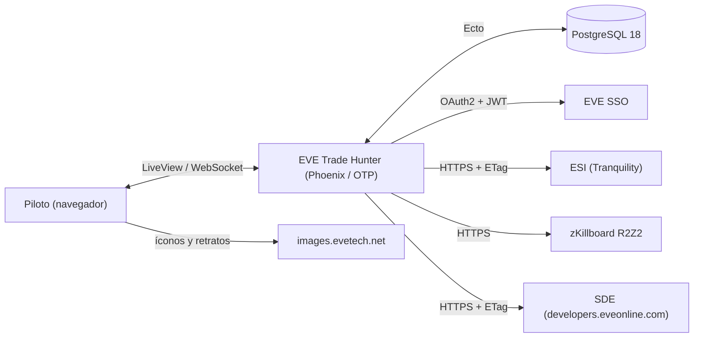
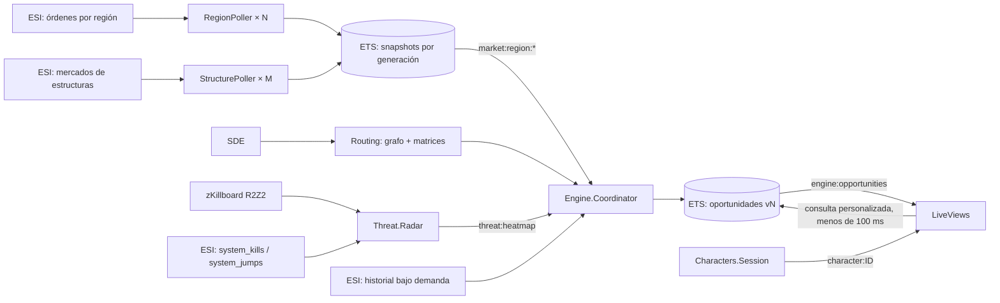
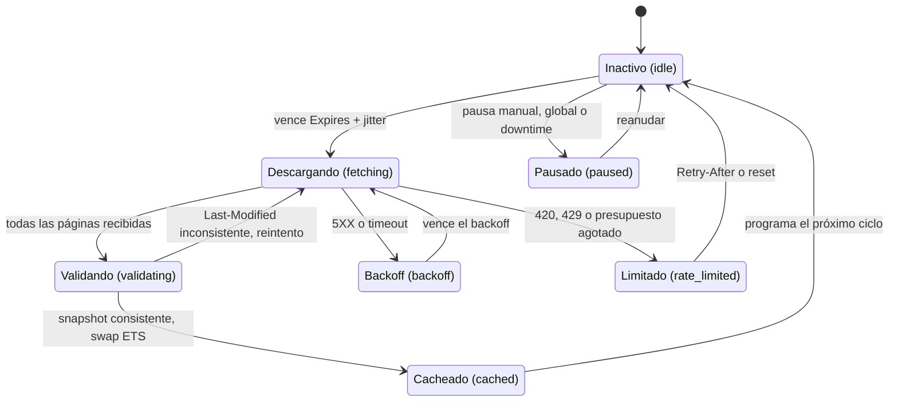
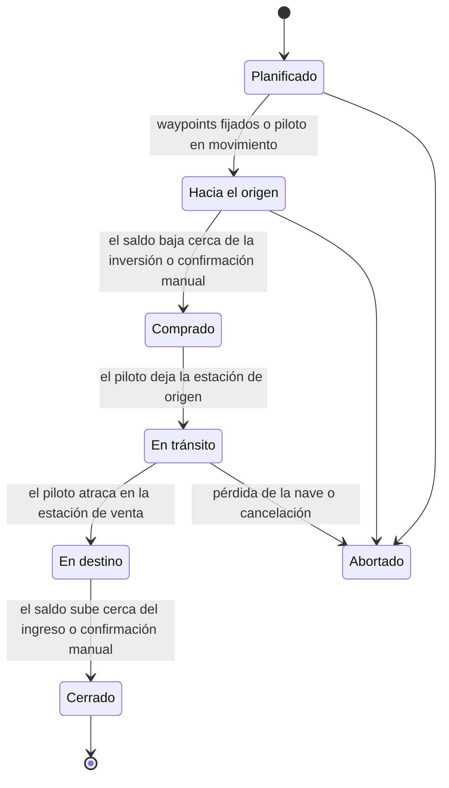

# Especificación de Requisitos de Software (ERS)

## EVE Trade Hunter (`eth`) · Elixir/OTP

> **Documento vivo.** Es la fuente de verdad funcional del proyecto: todo cambio de alcance se registra aquí en el mismo commit/PR que lo implementa. Las decisiones de arquitectura se documentan como ADR en `docs/adr/`.

| Campo | Valor |
|---|---|
| Versión | 1.0 |
| Fecha | 2026-09-28 |
| Estado | Base para desarrollo — decisiones a confirmar en §15.2 |
| Autor | Hernan Jalabert |
| Repositorio | <https://github.com/benabhi/eth> |

### Historial de versiones

| Versión | Fecha | Cambios |
|---|---|---|
| 0.1 | 2026-09 | Borrador inicial de ideas. |
| 1.0 | 2026-09-28 | Reestructuración completa: verificación técnica contra la documentación vigente de ESI, SSO, SDE y zKillboard; corrección de supuestos (§1.6); requisitos con prioridad, fase y criterios de aceptación; arquitectura OTP; modelo de datos; algoritmos y fórmulas; wireframes; entorno Windows/Docker; estrategia de calidad; hoja de ruta; riesgos y trazabilidad con el borrador. |

### Índice

1. [Introducción](#1-introducción)
2. [Descripción general](#2-descripción-general)
3. [Arquitectura del sistema](#3-arquitectura-del-sistema)
4. [Requisitos funcionales](#4-requisitos-funcionales)
5. [Requisitos no funcionales](#5-requisitos-no-funcionales)
6. [Interfaces externas](#6-interfaces-externas)
7. [Modelo de datos](#7-modelo-de-datos)
8. [Algoritmos y reglas de negocio](#8-algoritmos-y-reglas-de-negocio)
9. [Diseño de interfaz](#9-diseño-de-interfaz)
10. [Infraestructura y entorno de desarrollo](#10-infraestructura-y-entorno-de-desarrollo)
11. [Estrategia de calidad](#11-estrategia-de-calidad)
12. [Plan de entregas](#12-plan-de-entregas)
13. [Riesgos](#13-riesgos)
14. [Trazabilidad con el borrador 0.1](#14-trazabilidad-con-el-borrador-01)
15. [Decisiones y supuestos](#15-decisiones-y-supuestos)
- [Anexo A · Glosario](#anexo-a--glosario)
- [Anexo B · Constantes y parámetros por defecto](#anexo-b--constantes-y-parámetros-por-defecto)
- [Anexo C · Referencias](#anexo-c--referencias)

### Convenciones de este documento

- **Normativo:** *deberá* = obligatorio · *debería* = recomendado · *podrá* = opcional.
- **Prioridad (MoSCoW):** **M** imprescindible · **S** importante · **C** deseable · **W** no en esta versión.
- **Fase:** F0–F10 según §12.
- **IDs estables:** `RF-x.y` (funcional), `RNF-x.y` (no funcional), `AS-n` (reglas anti-scam), `D-nn` / `P-nn` (decisiones). Se citan en `@moduledoc`, tests y commits (`Refs: RF-1.4`).
- **CA:** criterios de aceptación verificables.
- *(calibrable)*: valor inicial configurable en tiempo de ejecución (Anexo B.7).
- Los datos del juego que CCP puede cambiar (impuestos, límites, IDs) llevan fecha de verificación y **nunca** se escriben como literales en el código (RNF-15).
- **Números:** en la prosa y las fórmulas se usa coma decimal (3,375 %); en los valores de configuración y en los mockups de UI, punto decimal y coma de miles (estilo EVE: `1,234.56`, RNF-5.5).

---

## 1. Introducción

### 1.1 Propósito del documento

Este documento especifica **qué** debe hacer EVE Trade Hunter, **bajo qué restricciones** y **cómo se verifica**, con detalle suficiente para desarrollar sin reabrir discusiones de alcance. Además de los requisitos (§4–§5) incluye un **diseño técnico de referencia** (§3, §7, §8) y el **plan de entregas** (§12). El diseño puede evolucionar; los cambios relevantes se registran como ADR y se reflejan aquí.

### 1.2 Visión: la "magia" del sistema

EVE Trade Hunter es un asistente táctico para comerciantes-transportistas de EVE Online bajo la filosofía **"Cero Fricción" (Zero-Touch)**: el piloto abre la aplicación y, sin configurar nada, ve las oportunidades de arbitraje que **puede ejecutar ahora mismo** con su billetera real, su nave actual, su ubicación física, sus habilidades y sus impuestos exactos (vía EVE SSO).

El sistema escanea de forma autónoma el mercado de todo New Eden, optimiza el espacio de bodega, planifica el retorno, vigila las amenazas de la ruta en tiempo real y bloquea las estafas de manipulación de mercado. Además, acompaña al piloto durante el viaje y, al terminar, mide el beneficio real obtenido.

### 1.3 Pilares diferenciales

| # | Pilar | Qué significa en el producto |
|---|---|---|
| 1 | **Omnisciencia** | Cruza todas las regiones (y las estructuras accesibles) simultáneamente y descubre rutas invisibles para las herramientas centradas en hubs. |
| 2 | **Cero fatiga de clics** | Lee billetera, habilidades, standings, nave y ubicación en vivo: oculta lo impagable y calcula el margen al centavo. |
| 3 | **Triángulo de ruta** | Mide "piloto → compra → venta" y lo convierte en **ISK/hora**, no solo en margen bruto. |
| 4 | **Logística autónoma** | Agrupa objetos en un mismo viaje (Tetris) y busca carga de retorno automáticamente. |
| 5 | **Inteligencia de amenazas adaptativa** | Ajusta la viabilidad en vivo según las muertes recientes, la nave del piloto y el **valor de la carga**. |
| 6 | **Inmunidad a estafas** | Cruza anomalías con el historial de precios y bloquea las trampas de *margin trading*. |
| 7 | **Acompañamiento en ruta** *(nuevo)* | Durante el viaje revalida las órdenes, alerta amenazas en la ruta y sugiere desvíos o mejores destinos. |
| 8 | **Ciclo cerrado** *(nuevo)* | Compara el beneficio proyectado con el real (transacciones de la billetera) y calibra la Certeza. |
| 9 | **Explicabilidad** *(nuevo)* | Todo número (margen, TVS, Certeza) tiene un desglose "¿por qué?" a un clic. |

### 1.4 Alcance (v1.0)

- Adquisición concurrente y respetuosa de órdenes de mercado de todas las regiones K-space y de estructuras Upwell accesibles (ESI).
- Datos estáticos (SDE) para mapa, estaciones y objetos; ruteo local con modos de seguridad.
- Radar de amenazas en vivo (zKillboard R2Z2) con línea base histórica (ESI).
- Motor de evaluación: arbitraje instantáneo entre ubicaciones con profundidad de libro, impuestos exactos, liquidez, anti-scam, combos, retorno, TVS y Certeza.
- Contexto personal vía EVE SSO (billetera, habilidades, standings, ubicación, nave), con multi-personaje y modo invitado.
- UI web reactiva (Phoenix LiveView): Cazador, Viaje activo, Centro de control y Ajustes.
- Infraestructura con Docker Compose (desarrollo en Windows + VS Code) y release de producción.

### 1.5 Fuera de alcance (no-objetivos de v1.0)

- Station trading (comprar y vender con órdenes propias en la misma estación) — candidato futuro.
- Modo Listado (vender publicando órdenes de venta) — planificado para v1.x (RF-4.1, F10).
- Contratos (intercambio de objetos, courier), industria, PI, minería.
- Billeteras y órdenes corporativas.
- Jump freighters con cynos, puentes Ansiblex, espacio de agujeros de gusano y Thera (futuro: integración con EVE-Scout).
- Automatizar acciones del cliente del juego más allá de lo que ESI permite (fijar waypoints, abrir la ventana de mercado). Nunca bots.
- SaaS multiusuario/multi-tenant: la arquitectura no lo impide, pero no se implementa.
- PLEX: desde julio de 2025 opera en un mercado global único y no admite arbitraje geográfico.

### 1.6 Correcciones clave respecto del borrador 0.1

Verificado contra la documentación oficial vigente al 2026-09-28 (fuentes en el Anexo C):

| # | Supuesto del borrador | Realidad verificada | Impacto en el diseño |
|---|---|---|---|
| 1 | Radar de kills con "polling en vivo de ESI". | ESI no ofrece un stream global de killmails; `/universe/system_kills` agrega la última hora con caché de 1 h. RedisQ de zKillboard se discontinuó el **31-may-2026**; su reemplazo es **R2Z2**. | Radar = zKillboard R2Z2 (tiempo real) + ESI `system_kills`/`system_jumps` (línea base). RF-3.x |
| 2 | Descarga libre de todas las regiones. | Desde el **24-feb-2026**, `/markets/{region_id}/orders` tiene rate limit: **12.000 tokens / 15 min por IP** (2XX = 2 tokens, 3XX = 1, 4XX = 5, 5XX = 0). Escanear las 113 regiones de ESI (≈ 1.723 páginas) cada 5 min consume ≈ 10.338 tokens: **≈ 86 %**. Medido el 2026-09-29 sobre las 69 regiones escaneables: 1.595 páginas ⇒ **≈ 80 %** (§8.11). | Gestor de presupuesto, niveles de prioridad, ETag/304 y exclusión de regiones sin mercado. RF-1.2, RF-1.7 |
| 3 | Historial de precios para todas las oportunidades. | `/markets/{region_id}/history` devuelve **un tipo en una región por request**, con un límite de **300 req/min**, y se actualiza una vez por día. | Historial **bajo demanda**, solo para candidatos, cacheado hasta el downtime. RF-1.12 |
| 4 | "Broker Fee/Sales Tax" siempre. | En arbitraje instantáneo (comprar a órdenes de venta y vender a órdenes de compra) **no se paga broker fee**, solo *sales tax*: 7,5 % × (1 − 0,11 × Accounting) = 3,375 % con Accounting V (vigente desde el 12-mar-2025). El broker fee solo se paga al **publicar** órdenes. | Impuestos según el modo de ejecución. RF-4.5 |
| 5 | Venta solo en la estación de la orden. | Las órdenes de compra tienen **rango** (estación, sistema, N saltos, región) y `min_volume`: se puede vender desde otra estación dentro del rango. | Venta remota por rango: rutas más cortas y oportunidades "sin moverse". RF-4.3 |
| 6 | Ejemplo con PLEX. | PLEX opera en el **Mercado Global de PLEX** (región 19000001) desde el 7-jul-2025. | PLEX excluido; región 19000001 fuera del escaneo. RF-4.15 |
| 7 | Rutas versionadas (`/v1/...`). | ESI migró a rutas sin versión + cabecera **`X-Compatibility-Date`** (sin cabecera se usa la fecha más antigua disponible). | El cliente fija una fecha de compatibilidad configurable. RF-1.1 |
| 8 | SDE genérico. | CCP reformuló el SDE (sep-2025): archivos **JSONL/YAML**, número de build, feed de cambios y soporte de ETag. | Carga y actualización automática por build. RF-2.1 |
| 9 | "Ueberauth con estrategia OAuth2". | `ueberauth_eve_sso` tiene una única versión (0.1.0, de 2019) y no se mantiene. | Estrategia Ueberauth propia con validación JWT/JWKS. RF-5.1 |
| 10 | Exactamente 9 scopes. | Dos scopes más aportan mucho: `esi-location.read_online.v1` (polling según actividad, ahorra presupuesto) y `esi-ui.open_window.v1` (abrir el mercado del ítem en el juego). Agregar scopes después obliga a volver a loguear todos los personajes. | 11 scopes. RF-5.2 |
| 11 | Epithal con 44.800 m³ para PLEX y Cap Boosters. | La bodega grande de la Epithal es **exclusiva para comodidades planetarias**; su carga general es pequeña. | La capacidad considera solo la bodega general; perfiles por nave. RF-5.8 |
| 12 | `[Forzar Pull]` en cualquier momento. | Pedir antes de `Expires` devuelve el mismo caché, y **eludir la caché de ESI puede causar un baneo**. | "Actualizar ahora" solo si `Expires` venció o si la región está en error. RF-8.8 |
| 13 | Live reload con `volumes: .:/app` en Windows. | Los contenedores Linux solo reciben eventos `inotify` si los archivos están en un sistema de archivos Linux (WSL2); Tailwind v4 eliminó `--poll`. | Código dentro de WSL2 (recomendado) o *fallback* por polling. RNF-11 |
| 14 | `version: '3.8'` y un único servicio. | Compose v2 ignora `version`. Además hace falta una base de datos (tokens cifrados, perfiles, historial, viajes). | Compose con PostgreSQL 18, volúmenes nombrados y healthchecks. §10 |

### 1.7 Criterios de éxito del producto

- **Tiempo a la primera decisión:** con datos en memoria, < 5 s desde que se abre la app hasta ver una oportunidad accionable personalizada.
- **Precisión:** en ≥ 80 % de los viajes cerrados, el beneficio real queda dentro de ±15 % del proyectado.
- **Seguridad del jugador:** 0 ejecuciones sobre oportunidades marcadas como SCAM (acciones bloqueadas).
- **Ciudadanía API:** uso promedio del presupuesto de mercado ≤ 80 %; 0 respuestas 420/429 en operación normal; 0 baneos.
- **Disponibilidad:** motor operativo ≥ 99 % del tiempo fuera del downtime de Tranquility.

---

## 2. Descripción general

### 2.1 Perspectiva del producto

Aplicación web **autoalojada** (self-hosted) que corre en Docker y se usa desde el navegador, típicamente en un segundo monitor mientras se juega.



### 2.2 Perfiles de usuario

| Perfil | Nave típica | Qué necesita del sistema |
|---|---|---|
| Transportista de highsec | Iteron Mark V, DST | Rutas seguras, ISK/h, combos que llenen la bodega, alertas de ganking en sistemas conocidos. |
| Corredor de bloqueo | Blockade Runner | Carga de alto valor y poco volumen por low/null; el radar es crítico, pero su nave tolera más riesgo. |
| Piloto de freighter | Freighter | Volúmenes grandes entre hubs; muy sensible al **valor de la carga** (atractivo para gankers). |
| Operador multi-personaje | Varios alts | Ver oportunidades para cada personaje según dónde esté y qué nave tenga. |

### 2.3 Modelo de operación

- **Instancia autoalojada** para **un operador** humano que vincula **1..N personajes** (main y alts). Los datos personales viven solo en esa instancia.
- **Modo invitado:** sin login, con capital, bodega y habilidades ingresados a mano y sin acciones in-game. Útil para probar la app y durante el desarrollo.
- **Personaje activo:** su contexto (ubicación, nave, billetera, impuestos) personaliza el Cazador; los demás personajes mantienen la sesión con polling reducido.
- **Datos universales compartidos:** el escaneo de mercado, el radar y el ruteo son comunes; la personalización se aplica en tiempo de consulta (RF-4.14).
- **Evolución a multiusuario** (fuera de alcance): requeriría multi-tenant en la DB, HTTPS obligatorio y cuotas; la separación entre datos universales y personales lo facilita.

### 2.4 Restricciones

- **Latencia inherente de los datos:** caché de ESI de 5 min en órdenes, 1 h en precios agregados y diaria en el historial.
- **Presupuestos de ESI** (Anexo B.5). El de órdenes de mercado es **por IP**: otras herramientas de EVE en la misma red lo comparten.
- **ESI no expone:** el broker fee de las estructuras, la capacidad de carga efectiva (habilidades y módulos), el dueño de una orden, el escrow de las órdenes de compra ni la preferencia de ruta del autopiloto.
- **Downtime diario** de Tranquility a las 11:00 UTC.
- **Estructuras:** el acceso depende de ACL que pueden cambiar sin aviso; el mercado de una estructura solo se puede leer con un personaje que tenga acceso.
- **Políticas de CCP:** sin automatización del cliente; solo endpoints oficiales.
- **Entorno de desarrollo:** Windows 11 + VS Code + Docker Desktop.

### 2.5 Supuestos y dependencias

- Disponibilidad de ESI, SSO y SDE (CCP) y de R2Z2 (zKillboard, un tercero).
- El operador registra una aplicación en <https://developers.eveonline.com> con el callback exacto y los scopes de RF-5.2.
- Hardware de referencia: 4 núcleos, 16 GB de RAM, SSD.
- Los valores del juego (impuestos, límites) son los vigentes al 2026-09-28 y pueden cambiar (RNF-15).

### 2.6 Principios de diseño

1. **Cero fricción:** lo que se puede inferir no se pregunta, y lo que se pregunta, se pregunta una sola vez.
2. **Explicabilidad:** cada cifra tiene su desglose.
3. **La seguridad del jugador primero:** ante la duda, bloquear y explicar (anti-scam, amenazas).
4. **Ciudadanía API ejemplar:** nunca por encima de los límites y siempre respetando la caché.
5. **Degradación elegante:** sin radar, sin SSO o sin historial la app sigue funcionando y lo indica.
6. **Las reglas del juego son datos, no código.**
7. **Memoria primero:** consultas contra memoria (ETS); persistencia solo para lo durable.

---

## 3. Arquitectura del sistema

### 3.1 Stack tecnológico

| Capa | Tecnología | Versión objetivo | Notas |
|---|---|---|---|
| Lenguaje / VM | Elixir + Erlang/OTP | Elixir 1.20.x · OTP 28 o 29 | Última estable al iniciar (al 2026-09: Elixir 1.20.2, OTP 29.1). |
| Web | Phoenix + LiveView | Phoenix 1.8.x · LiveView 1.2.x | Streams, colocated hooks, `AGENTS.md`, alias `mix precommit`. |
| UI | Tailwind CSS v4 + daisyUI | Incluidos por Phoenix 1.8 | Temas claro/oscuro/sistema; sin Node (binarios standalone). |
| HTTP | Req + Finch | Req ≥ 0.5 | Reintentos; `Req.Test` para stubs en tests. |
| Autenticación | Ueberauth + estrategia EVE SSO propia; Joken o JOSE para JWT | — | `ueberauth_eve_sso` no se mantiene. |
| Persistencia | PostgreSQL 18 + Ecto; Cloak.Ecto | — | Refresh tokens cifrados, perfiles, historial, viajes. |
| Jobs | Oban (+ Oban Web) | — | Tareas periódicas y durables: SDE diario, historial post-DT, línea base, P&L, limpieza. |
| Grafos | BFS propio (sin dependencias) | — | Matrices de distancia precomputadas; el Dijkstra ponderado del modo Evasiva (F6) también será propio. |
| Memoria | ETS · `:persistent_term` | — | Órdenes, oportunidades y calor en ETS; SDE y matrices en `persistent_term`. |
| Observabilidad | `:telemetry`, Telemetry.Metrics, Phoenix LiveDashboard | — | |
| Calidad | ExUnit, StreamData, Mox, Credo, Dialyxir, Sobelow, mix_audit, Benchee | — | |
| Contenedores | Docker + Compose v2 | — | Desarrollo en WSL2; producción con `mix release`. |

### 3.2 Árbol de supervisión (referencia)

```text
Eth.Supervisor (one_for_one)
├── EthWeb.Telemetry
├── Eth.Repo
├── {Phoenix.PubSub, name: Eth.PubSub}
├── {Finch, name: Eth.Finch}                      # pools HTTP: ESI, SSO, R2Z2, SDE
├── {Oban, ...}                                    # jobs periódicos y durables
├── Eth.Events                                     # registro de eventos del sistema
├── Eth.Esi.Supervisor (rest_for_one)
│   ├── Eth.Esi.Budget                             # rate limit por grupo + error limit (ETS público)
│   ├── {Task.Supervisor, name: Eth.Esi.TaskSupervisor}
│   └── Eth.Esi.ServerStatus                       # /status + detección de downtime
├── Eth.Sde.Store                                  # carga/recarga del SDE (persistent_term)
├── Eth.Routing.Graph                              # grafos + matrices de distancia
├── Eth.Market.Supervisor (rest_for_one)
│   ├── Eth.Market.TableOwner                      # dueño estable de las tablas ETS de órdenes
│   ├── {Registry, keys: :unique, name: Eth.Market.Registry}
│   ├── Eth.Market.RegionSupervisor                # DynamicSupervisor → RegionPoller × N
│   ├── Eth.Market.StructureSupervisor             # DynamicSupervisor → StructurePoller × M
│   ├── Eth.Market.Scheduler                       # niveles de prioridad según presupuesto
│   ├── Eth.Market.Prices                          # /markets/prices
│   └── Eth.Market.History                         # cola de historial (≤ 250 req/min)
├── Eth.Threat.Supervisor
│   ├── Eth.Threat.Radar                           # mapa de calor (ETS)
│   ├── Eth.Threat.KillFeed                        # adaptador R2Z2 / killmail.stream
│   └── Eth.Threat.Baseline                        # system_kills / system_jumps horarios
├── Eth.Engine.Supervisor
│   ├── {Task.Supervisor, name: Eth.Engine.TaskSupervisor}
│   └── Eth.Engine.Coordinator                     # evaluación incremental y versionado
├── Eth.Characters.Supervisor                      # DynamicSupervisor → Session × K (tokens + polling)
├── Eth.Tracking.Supervisor                        # DynamicSupervisor → RunMonitor × R (viajes activos)
├── Eth.Notifications.Dispatcher
└── EthWeb.Endpoint
```

### 3.3 Flujo de datos



### 3.4 Almacenamiento en memoria

| Nombre | Tipo | Dueño | Contenido | Notas |
|---|---|---|---|---|
| `eth_orders_<fuente>_<gen>` | ETS `ordered_set` | `Market.TableOwner` | Clave `{type_id, side, sort_price, order_id}` → ubicación, sistema, volumen restante, `min_volume`, rango, `issued` | Una por región o estructura y por generación; `read_concurrency`. |
| `eth_market_catalog` | ETS `set` | `Market.TableOwner` | fuente → tabla vigente, generación, `Last-Modified`, `Expires`, conteos, bytes, estado | Swap atómico del snapshot. |
| `eth_type_summary` | ETS `set` | `Market.TableOwner` | `{fuente, type_id}` → mejores precios y profundidad top-K por ubicación | Base del screening. |
| `eth_opportunities` | ETS `set` | `Engine.Coordinator` | id → oportunidad universal (versión N) | Lectura pública. |
| `eth_threat_heat` | ETS `set` | `Threat.Radar` | system_id → intensidad, alerta, tipo, índice | |
| `eth_esi_budget` | ETS `set` | `Esi.Budget` | grupo (y personaje) → límite, restante, actualizado; error limit | Consulta previa a cada request. |
| `eth_history_stats` | ETS `set` | `Market.History` | `{region_id, type_id}` → estadísticas | Caché caliente de la DB. |
| `eth_prices` | ETS `set` | `Market.Prices` | type_id → precio promedio y ajustado | |
| SDE | `:persistent_term` | `Sde.Store` | Mapas de sistemas, tipos, estaciones y grupos | Solo cambia con un build nuevo. |
| Matrices de distancia | `:persistent_term` | `Routing.Graph` | Binarios de 1 byte por par (Rápida y Segura) | ≈ 29 MB cada una. |

### 3.5 Tópicos PubSub

| Tópico | Emisor | Contenido | Suscriptores |
|---|---|---|---|
| `market:region:<id>` / `market:structure:<id>` | Pollers | `{:snapshot, fuente, gen, stats}` | `Engine.Coordinator`, Centro de control |
| `market:status` | Scheduler, Budget | Estados de pollers y presupuesto | Centro de control |
| `engine:opportunities` | Coordinator | `{:version, v, diff}` (altas, cambios, bajas) | Cazador, RunMonitor, Notificaciones |
| `threat:heatmap` | Radar | Cambios de índice por sistema | Coordinator, Cazador, RunMonitor, Centro de control |
| `threat:kills` | KillFeed | Killmail normalizada | Centro de control (feed) |
| `character:<id>` | Characters.Session | Ubicación, nave, billetera, estado del token | Cazador, RunMonitor |
| `run:<id>` | RunMonitor | Etapa, alertas, revalidación | Viaje activo |
| `system:events` | `Eth.Events` | Evento del registro | Centro de control |
| `system:status` | ServerStatus | Tranquility en línea/DT, VIP | Todos los LiveViews (banner) |

### 3.6 Estructura del código (referencia)

```text
lib/
├── eth/
│   ├── esi/            # Cliente ESI, presupuesto (rate/error limit), estado del servidor
│   ├── sso/            # Estrategia Ueberauth EVE SSO, validación JWT/JWKS, tokens
│   ├── sde/            # Descarga, procesamiento y consulta del SDE
│   ├── routing/        # Grafo, matrices de distancia, modos de ruta, anclas de waypoints
│   ├── market/         # Pollers, tablas ETS, estructuras, precios, historial
│   ├── threat/         # Kill feed, radar, línea base, clasificación
│   ├── engine/         # Screening, walk-the-book, impuestos, anti-scam, combos, retorno, scoring
│   ├── characters/     # Sesiones de personaje, contexto y perfiles de nave
│   ├── accounts/       # Operador, scope de sesión y ajustes
│   ├── tracking/       # Viajes activos y P&L
│   ├── notifications/  # Reglas y despacho de alertas
│   ├── replay/         # Grabación y reproducción de datos (modo Replay)
│   ├── game_rules.ex   # Reglas del juego configurables (impuestos, exclusiones, etc.)
│   ├── clock.ex        # Reloj inyectable (tests de lógica temporal)
│   └── events.ex       # Registro de eventos del sistema
└── eth_web/
    ├── components/     # core_components + grid, route_strip, sec_badge, gauge, sparkline, region_tile
    ├── live/           # hunter_live, run_live, control_live, settings_live
    ├── controllers/    # auth_controller (SSO), health_controller
    └── router.ex
priv/
├── repo/migrations/
├── gettext/es/LC_MESSAGES/
└── data/               # (ignorado por git) SDE procesado, matrices, snapshots/, replay/
test/
└── support/fixtures/   # esi/, r2z2/, sde_min/
dev/                    # código solo de desarrollo (MIX_ENV=dev), p. ej. Eth.Dev.TailwindPoller
scripts/                # check-authorship.sh (CI)
.githooks/              # commit-msg (autoría, RNF-12.6)
docs/
├── ERS.md              # esta especificación
└── adr/                # decisiones de arquitectura (y otros documentos futuros)
```

---

## 4. Requisitos funcionales

Formato: **RF-x.y · Nombre** — prioridad · fase. Los módulos M1–M10 reemplazan a los cinco módulos del borrador (mapeo completo en §14).

### M1 · Adquisición de datos de mercado

#### RF-1.1 · Cliente ESI centralizado — M · F0

El sistema deberá acceder a ESI exclusivamente a través de un cliente único (`Eth.Esi.Client`) que:

- envíe un `User-Agent` descriptivo (RNF-3.1), `X-Compatibility-Date` (configurable), `Accept-Encoding: gzip` e `If-None-Match` cuando exista un ETag previo;
- inyecte el access token vigente del personaje en las rutas autenticadas;
- devuelva, además del cuerpo, los metadatos: `Expires`, `Last-Modified`, `ETag`, `X-Pages`, `X-Ratelimit-*`, `X-ESI-Error-Limit-*`, `Retry-After`, `Warning` y la latencia;
- consulte el presupuesto (RF-1.7) **antes** de cada request y lo actualice con cada respuesta;
- emita un evento `:telemetry` por request.

**CA**

- Ningún módulo fuera de `Eth.Esi` construye URLs de ESI (verificable con un check de Credo o una búsqueda).
- Una respuesta con cabecera `Warning` (ruta deprecada) genera un evento *warning* una vez por ruta y día.
- Sin `ESI_COMPATIBILITY_DATE` se usa la fecha fija de `config/config.exs` (nunca "hoy").

#### RF-1.2 · Catálogo de regiones y niveles de prioridad — M · F1

- El conjunto por defecto deberá incluir todas las regiones K-space con mercado (obtenidas del SDE) y excluir J-space, el espacio abisal o especial, Pochven y la región del Mercado Global de PLEX (Anexo B.4). Será configurable desde la UI y con `ETH_REGIONS` (subconjunto para desarrollo).
- Cada región tendrá un nivel: **N1 Hubs** (The Forge, Domain, Sinq Laison, Heimatar, Metropolis), **N2 Activas** (≥ 5 páginas en el último ciclo) y **N3 Resto**. Se recalcula automáticamente y admite override manual.
- La frecuencia por nivel se ajusta según el presupuesto disponible (§8.11).

**CA:** con `ETH_REGIONS=10000002,10000043` existen solo 2 pollers; con presupuesto < 10 % solo se actualiza N1.

#### RF-1.3 · Poller regional con máquina de estados — M · F1

Cada región tendrá su propio proceso (`Eth.Market.RegionPoller`, GenServer bajo `DynamicSupervisor` + `Registry`) con los estados de la figura. El próximo ciclo se programa en `Expires + jitter` (1–5 s, *calibrable*) y **nunca** antes de `Expires`. Las requests HTTP corren en tareas supervisadas: el poller nunca se bloquea.



Los estados *Degradado* y *Viejo* son derivados: dependen de la edad del último snapshot válido (RF-4.9) y se muestran en el Centro de control.

**CA**

- Matar un poller no afecta a los demás ni borra su último snapshot (RNF-2.1).
- La telemetría muestra 0 requests de una región entre su `Expires` anterior y el ciclo siguiente.

#### RF-1.4 · Descarga paginada consistente — M · F1

- Pedir la página 1, leer `X-Pages` y descargar el resto con concurrencia acotada (*calibrable*: 8 por región, 16 global).
- Validar que **todas** las páginas compartan `Last-Modified` y `X-Pages`. Si no, volver a pedir las divergentes (máximo 2 reintentos) o descartar el ciclo **sin** publicar datos mezclados.
- Guardar el `ETag` de cada página; ante `304 Not Modified`, reutilizar esa página de la generación anterior (cuesta 1 token en lugar de 2).

**CA:** un fixture con páginas de dos generaciones distintas nunca produce un snapshot publicado; un ciclo sin cambios consume 1 token por página.

#### RF-1.5 · Almacenamiento ETS con doble buffer — M · F1

- Cada ciclo exitoso construye una **tabla nueva** (generación N+1), `ordered_set`, con clave `{type_id, side, sort_price, order_id}` (`sort_price = price` en ventas y `−price` en compras): un recorrido por el prefijo `{type_id, side}` devuelve el libro ya ordenado.
- Al terminar, se actualiza atómicamente el catálogo (`eth_market_catalog`) y la generación anterior se elimina tras un período de gracia (*calibrable*: 60 s) para no invalidar lecturas en curso.
- Durante la construcción se precalculan resúmenes por tipo y ubicación (mejor precio y profundidad top-K) para el screening (RF-4.2).
- Las tablas pertenecen a un proceso dueño estable (`Eth.Market.TableOwner`), no al poller.

**CA:** una evaluación del motor nunca ve un libro parcialmente cargado; la memoria por región es visible en el Centro de control.

#### RF-1.6 · Mercados de estructuras Upwell — S · F7

- Registro de estructuras con mercado: la lista pública (`/universe/structures?filter=market`) más los IDs que agregue el usuario (estructuras privadas a las que tiene acceso).
- Resolución de nombre y sistema con `/universe/structures/{id}` y lectura con `/markets/structures/{id}`, usando el token de un personaje con acceso (preferencia: el activo).
- Acceso por personaje: un `403` marca la estructura como *sin acceso* para ese personaje, con reintento a las 24 h. Nunca se reintenta en bucle (consume presupuesto de errores).
- Selección por defecto: estructuras públicas de las regiones habilitadas, top 30 por cantidad de órdenes, más las elegidas por el usuario (*calibrable*).
- Fusión con las órdenes regionales **deduplicando por `order_id`** (la región puede incluir parte de las órdenes de estructuras).
- Las oportunidades en estructuras muestran una insignia de estructura y el estado de acceso del personaje activo.

**CA:** una estructura con 403 no vuelve a pedirse para ese personaje antes de 24 h; ninguna orden aparece dos veces.

#### RF-1.7 · Presupuesto de rate limit y guardas de error — M · F1

- `Eth.Esi.Budget` mantiene, por grupo de rate limit (y por personaje en las rutas autenticadas), los últimos `X-Ratelimit-Limit` y `X-Ratelimit-Remaining`; por separado, el *error limit* legado (`X-ESI-Error-Limit-Remain` / `-Reset`).
- Reserva mínima del 10 % del grupo de mercado (*calibrable*); por debajo de ella, el scheduler degrada niveles (§8.11).
- `429`: respetar `Retry-After` en ese grupo. `420` o `Error-Limit-Remain ≤ 20`: **pausa global** de ESI hasta el reset, con evento crítico.
- Backoff exponencial con jitter por poller (base 2 s, factor ×2, máximo 5 min, ±20 %) y *circuit breaker* (5 fallos seguidos ⇒ abierto 10 min).
- Todos los umbrales visibles y editables en el Centro de control.

**CA:** con un stub que responde `X-ESI-Error-Limit-Remain: 15`, no sale ningún request más hasta el reset.

#### RF-1.8 · Estado de Tranquility y downtime — M · F1

- Consultar `/status` cada 60 s (jugadores en línea, versión, `start_time`, `vip`).
- Ventana de downtime configurable (por defecto 10:59–11:15 UTC) más detección por errores o `vip`: pausar los pollers, no gastar presupuesto de errores y reanudar de forma escalonada cuando `/status` responda con un `start_time` nuevo.
- Banner global: "Tranquility en downtime · datos congelados desde HH:MM".

#### RF-1.9 · Precios de referencia globales — M · F3

Cargar `/markets/prices` (precio promedio y ajustado por tipo) cada vez que expire. Se usa en el pre-filtro anti-scam (AS-3) y para estimar el valor de la carga cuando no hay historial.

#### RF-1.10 · Reinicio en caliente — S · F1

Al apagarse y cada 10 min, persistir en disco (volumen de datos) la generación vigente de cada fuente con sus metadatos. Al arrancar, cargar las que tengan `Last-Modified` < 15 min y respetar el `Expires` guardado antes de volver a pedirlas. Las regiones restauradas se marcan como "Restaurado".

**CA:** un `docker compose restart` no dispara la descarga completa del universo si pasaron menos de 5 min.

#### RF-1.11 · Modo Replay — S · F1

Con `ETH_DATA_SOURCE=replay`, el sistema reproduce snapshots grabados (`mix eth.replay.record` copia los del reinicio en caliente) desde `priv/data/replay/`, en bucle y **sin** llamar a servicios externos. Permite desarrollar la UI, hacer demos y correr benchmarks deterministas. Las grabaciones pesan decenas de MB: viven en el volumen de datos, no en git. *(F6)* Se suman killmails grabados; *(C)* velocidad de reproducción configurable.

#### RF-1.12 · Historial de mercado bajo demanda — M · F5

- Cola priorizada (por TVS preliminar) de pares `(región, tipo)` candidatos, a un ritmo ≤ 250 req/min (límite de ESI: 300/min).
- Estadísticas derivadas (§7.2): mediana y promedio de 7 días, promedio de 30 días, desviación de 30 días, volumen promedio de 7 y 30 días y días con operaciones en 30 días.
- Vigencia hasta el siguiente downtime (el historial se actualiza una vez al día); después del DT (≥ 11:15 UTC) se refrescan solo los pares que sigan siendo relevantes.
- Persistencia en PostgreSQL y caché caliente en ETS.
- *(C)* Precarga opcional desde los datasets diarios de EVE Ref.

**CA:** nunca más de 250 requests de historial en una ventana de 60 s; un par ya consultado hoy no se vuelve a pedir.

### M2 · Datos estáticos y ruteo

#### RF-2.1 · Carga y actualización del SDE — M · F2

- En el primer arranque: descargar el SDE JSONL más reciente (con ETag), extraer solo los archivos necesarios, procesarlos y cachear el resultado por número de build en el volumen de datos.
- A diario: consultar `latest.jsonl` (clave `sde`); si hay un build nuevo, reprocesarlo en segundo plano y **recargar en caliente** (SDE, grafo y matrices) sin reiniciar.
- El build del SDE se muestra en el Centro de control.

**CA:** un segundo arranque con la caché presente no descarga nada y carga en < 15 s.

#### RF-2.2 · Catálogo estático requerido — M · F2

Sistemas (nombre, seguridad real, constelación, región), stargates y sus destinos, regiones, constelaciones, estaciones NPC (nombre, sistema, corporación dueña), tipos (nombre localizado, volumen, capacidad, grupo, categoría, grupo de mercado, `published`), grupos y categorías, corporaciones NPC → facción y, *(C)*, atributos de naves para estimar tiempos. Los nombres exactos de archivos y campos se toman del esquema publicado del SDE.

El SDE **no trae el nombre armado de las estaciones** (solo índices de planeta y luna, corporación y operación). Se resuelven con ESI `/universe/names` (6 requests para ≈ 5.200 estaciones) al procesar cada build; si ESI no responde, se componen con la regla del cliente (`<sistema> <planeta romano> - Moon <n> - <corporación> <operación>`), que no contempla los planetas con nombre propio ("Amarr VIII (Oris)").

#### RF-2.3 · Volumen empaquetado — M · F2

El flete se calcula con el **volumen empaquetado** (en naves y algunos módulos difiere del volumen armado). Fuente: el campo `packagedVolume` de `types.jsonl` (verificado 2026-09-29: Rifter 27.289 m³ armado vs 2.500 m³ empaquetado); si faltara, se usa `volume`. No hace falta pedirlo a ESI.

#### RF-2.4 · Grafo de navegación y matrices de distancia — M · F2

- Grafo de stargates de K-space, usando solo la componente conexa principal. Excluidos (*configurable*): J-space, Pochven, Zarzakh (mecánica de gates especial) y sistemas sin conexión.
- Precomputar dos matrices de saltos (BFS desde cada sistema): **Rápida** (todos los sistemas) y **Segura** (solo highsec). Representación compacta (1 byte por par, 255 = inalcanzable; ≈ 29 MB por matriz) en `:persistent_term`, cacheada en disco por build.
- Distancia en O(1) para el screening; los caminos concretos se calculan bajo demanda.

**CA:** distancias verificadas contra casos conocidos (fixtures) y propiedades: simetría, `Segura ≥ Rápida` y desigualdad triangular.

**Verificación contra ESI (2026-09-29, build 3552227: 5.227 sistemas ruteables, construcción 23 s, carga desde caché 0,4 s).** Se compararon 68 pares con `/latest/route` (la ruta sin versión `/route/{o}/{d}` figura en la especificación pero responde 404):

- **Rápida:** idéntica en los pares entre hubs (Jita→Amarr 11, Jita→Dodixie 12, Jita→Rens 15, Amarr→Hek 15). Las diferencias en nullsec se deben a que ESI rutea por **Zarzakh** (excluido a propósito); ESI no encuentra ruta hacia la región **Exordium** (10001004), que el grafo sí conecta.
- **Segura:** no es comparable. El `secure` de ESI significa "preferir seguro" (admite low/null y usa otro costo: Jita→Amarr 45 saltos), mientras que el modo Segura de la app es **estrictamente highsec** (seguridad real ≥ 0,45): Jita→Amarr 34 saltos. Si un extremo no es highsec, no hay ruta Segura.

#### RF-2.5 · Modos de ruta y sistemas a evitar — M · F2 (Evasiva: S · F6)

- **Segura:** solo sistemas highsec (seguridad real ≥ 0,45). Si el origen o el destino no son highsec, la oportunidad no es ruteable en este modo.
- **Rápida:** mínimo número de saltos.
- **Evasiva:** camino de costo mínimo con costo por sistema `1 + α · amenaza(s)` (*α calibrable*), calculado bajo demanda para las oportunidades visibles y los viajes activos.
- **Sistemas a evitar:** lista del usuario (por ejemplo, sistemas de ganking conocidos) que se aplica a los caminos concretos de todos los modos; las oportunidades cuyo camino cambia se recalculan.

#### RF-2.6 · Clasificación y colores de seguridad — M · F2

Regla de redondeo del cliente (0 < sec < 0,05 se muestra como 0,1; el resto, a un decimal), bandas highsec/lowsec/nullsec y escala de colores del Anexo B.6. El color siempre va acompañado del valor numérico.

#### RF-2.7 · Estimación de tiempo de viaje — M · F3

`T = saltos × t_salto(clase de nave) + paradas × t_parada` (Anexo B.7). *(C)* Tiempo de alineación a partir de atributos del SDE (masa, agilidad) y de las habilidades.

#### RF-2.8 · Triángulo de ruta — M · F3

Para cada oportunidad: saltos **piloto → origen**, **origen → destino** y total. Sin ubicación conocida (invitado u offline) se mide desde un **sistema base** configurable (por defecto Jita).

### M3 · Radar de amenazas

#### RF-3.1 · Ingesta de killmails en vivo — M · F6

- Fuente por defecto: **zKillboard R2Z2** (`sequence.json` + un archivo por secuencia), con 100 ms entre éxitos, 6 s tras un 404, ≤ 10 req/s (el límite duro es 15 req/s por IP, con baneo de 1 h) y `User-Agent` obligatorio.
- Adaptador intercambiable (`Eth.Threat.KillFeed`, behaviour), con implementación alternativa **killmail.stream** y opción `off`.
- Persistir la última secuencia procesada; tras un reinicio, continuar desde ella si tiene < 24 h (retención de R2Z2) y, si no, saltar a la más reciente.
- Descartar killmails con `killmail_time` fuera de la ventana de análisis.

**CA:** 1 h de operación sin 403/429 de R2Z2; tras un reinicio no se pierden las killmails de los últimos minutos.

#### RF-3.2 · Normalización y enriquecimiento — M · F6

Por killmail: sistema, hora, tipo, grupo y clase de la nave víctima (¿es de transporte?), cantidad de atacantes, personajes, corporaciones y alianzas atacantes, golpe final y su arma, `zkb.locationID` → celeste más cercano (si es un stargate: "en el gate hacia X"), valor total y marcas `npc`/`solo`. Las kills NPC (`zkb.npc`) se ignoran.

#### RF-3.3 · Mapa de calor en memoria — M · F6

Por sistema: kills PvP en ventana móvil (*calibrable*: 15 min), intensidad con decaimiento exponencial (vida media de 10 min), kills por stargate, víctimas por clase y atacantes únicos y repetidos. Tabla ETS de lectura concurrente; los cambios se publican en `threat:heatmap`.

#### RF-3.4 · Línea base histórica — M · F6

Instantáneas horarias de `/universe/system_kills` y `/universe/system_jumps` persistidas durante 30 días. Línea base λ por sistema y franja horaria UTC (con ≥ 7 días de datos); si faltan datos, el promedio general del sistema o un *prior* por banda de seguridad.

#### RF-3.5 · Detección por umbral adaptativo — M · F6

Un sistema entra en alerta **solo** si sus kills en la ventana son estadísticamente anómalas respecto de su línea base (Poisson, p < 0,01) **y** superan un mínimo absoluto (3). Una muerte aislada nunca genera una alerta (§8.8).

**CA:** en un sistema con mucho PvP habitual (λ alto), 3 kills no disparan la alerta; con λ ≈ 0, 3 kills en un gate sí.

#### RF-3.6 · Clasificación de amenazas — S · F6

Tipos `gate_camp`, `bubble_camp`, `smartbomb_camp`, `hauler_gank` y `roaming` (heurísticas en §8.8), con nivel de confianza y una descripción legible ("Gatecamp en el gate a Tama · 4 kills · 7 atacantes repetidos").

#### RF-3.7 · Índice de amenaza y riesgo base — M · F6

- Índice de amenaza por sistema (0–1), derivado de la alerta y su recencia.
- **Riesgo base** para sistemas sin alerta, proporcional a las kills por salto históricas: una ruta por lowsec nunca es "gratis".
- Ambos alimentan la Certeza de la ruta (RF-4.12) y el modo Evasiva (RF-2.5).

#### RF-3.8 · Degradación elegante del radar — M · F6

Si el feed en vivo no entrega datos durante > 2 min: estado "Radar degradado", uso exclusivo de la línea base horaria, penalización leve de la Certeza en rutas por low/null e indicador visible en la cabecera y en el Centro de control.

### M4 · Motor de evaluación

#### RF-4.1 · Modos de ejecución — M · F3 (Listado: S · F10)

- **Instantáneo** (MVP): comprar a órdenes de venta en el origen y vender a órdenes de compra en el destino. Solo se paga *sales tax*.
- **Listado** (v1.x): comprar a órdenes de venta y **publicar** una orden de venta en el destino. Se paga broker fee + *sales tax*; se estima el tiempo de venta según la velocidad histórica y la competencia; la Certeza es menor.
- *(W)* Comprar con órdenes de compra en el origen y station trading.

#### RF-4.2 · Cruce universal (screening) — M · F3

Para cada tipo con órdenes, combinar los resúmenes por ubicación (RF-1.5) de todas las fuentes: mejores precios de venta por ubicación frente a mejores precios de compra alcanzables (RF-4.3). Hay candidato si `bid × (1 − t_min) > ask`, donde `t_min` es el impuesto mínimo posible. Se paraleliza por tipo (`Task.async_stream`, con concurrencia = schedulers).

**Implementación v1 (2026-09-29):** para acotar el trabajo se evalúan como máximo 8 ubicaciones de compra por tipo (las más baratas) y 6 estaciones de venta por origen; cuando las mismas órdenes de compra se alcanzan desde varias estaciones (rango región), queda la más cercana. Medido con los 5 hubs (≈ 890 mil órdenes, 19.238 tipos): evaluación completa 431–593 ms; resúmenes incrementales 122–310 ms; consulta personalizada p50 8,9 ms y p95 33,6 ms (RNF-1.1).

#### RF-4.3 · Rango de órdenes y venta remota — M · F3

- Una orden de compra puede satisfacerse desde cualquier estación dentro de su `range` (`station`, `solarsystem`, `1`…`40` saltos, `region`), medido por la ruta más corta del juego.
- Para cada candidato se elige la **estación de venta** elegible con mayor ISK/h en el modo de ruta activo (a igualdad: menos saltos; después, NPC antes que estructura) según §8.2. Si la estación de origen es elegible: "venta en el lugar" (0 saltos).
- Respetar el `min_volume` (cantidad mínima por transacción) de cada orden.
- La UI indica "Vender en X · orden en Y (rango R)".

#### RF-4.4 · Profundidad de libro (walk-the-book) — M · F3

Calcular la cantidad óptima recorriendo el libro: las órdenes de venta de menor a mayor precio contra las órdenes de compra de mayor a menor, mientras el margen neto unitario sea positivo (≥ mínimo *calibrable*) y no se viole ninguna restricción (§8.3). Resultado: cantidad, costo, ingreso neto, beneficio, precios promedio y marginales y órdenes consumidas.

**CA (tests de propiedades):** nunca excede el stock, el capital, la bodega ni el valor máximo; el beneficio es ≥ 0 y no decrece al aumentar el capital.

#### RF-4.5 · Impuestos y comisiones — M · F3

- *Sales tax* = `base × (1 − 0,11 × Accounting)`, con base vigente de 7,5 % (Accounting V ⇒ 3,375 %).
- Broker fee en estaciones NPC (solo modo Listado) = `3 % − 0,3 % × Broker Relations − 0,03 % × standing con la facción − 0,02 % × standing con la corporación` (standings sin modificar).
- Broker fee en estructuras: lo fija el dueño y ESI no lo expone ⇒ override por estructura, con un valor por defecto conservador (*calibrable*).
- Modo invitado: nivel de Accounting supuesto configurable (por defecto IV).
- Todas las constantes viven en `Eth.GameRules` (RNF-15) y el desglose es visible en el detalle.

#### RF-4.6 · Restricciones personales — M · F3/F4

- **Capital:** saldo de la billetera × porcentaje máximo por operación (*calibrable*, por defecto 100 %) u override manual.
- **Bodega:** capacidad del perfil de la nave activa (RF-5.8) u override.
- **Valor en riesgo:** tope opcional de valor de carga por perfil de nave; limita la exposición a ganks.
- **Oportunidades impagables:** se recalculan con la cantidad que sí se puede pagar ("parcial") o se ocultan (toggle "Mostrar no asequibles").
- **Modo invitado (F3):** bodega por defecto de 38.500 m³ (Iteron Mark V con módulos de carga, *calibrable*) y ruta Segura. Sin tope de bodega el ranking lo dominaban cargas imposibles (naves capitales de 1.000.000 m³, millones de m³ de isótopos).

#### RF-4.7 · Filtro de liquidez — M · F5

Excluir (o marcar, según el filtro) los tipos con pocos días de operaciones en 30 días (*calibrable*: < 5) y calcular un **índice de liquidez** 0–1 a partir del volumen diario de 7 días frente a la cantidad a mover y de la profundidad de las órdenes de compra del destino. En modo Listado: descartar si el tiempo estimado de venta supera el máximo (*calibrable*: 7 días).

#### RF-4.8 · Escudo anti-scam — M · F5

- Aplicar las reglas AS-1…AS-8 (§8.7) a los candidatos con margen o ROI extremos y a todo candidato con historial disponible.
- Estados: `ok`, `sin_historial`, `sospechoso` y `scam`, con motivos legibles.
- `scam` ⇒ **☠️ SCAM ALERT**, Certeza 0 %, TVS 0 y acciones bloqueadas (Multibuy, Ruta, Viaje).
- Botón "Reportar falso positivo" (registro local para calibrar los umbrales).

**CA:** un fixture de *margin trading scam* (compra inflada 11× + venta inflada) resulta en `scam`; una oportunidad legítima con historial estable resulta en `ok`.

#### RF-4.9 · Frescura y ciclo de vida de las oportunidades — M · F3

- Edad de los datos = antigüedad máxima (`Last-Modified`) entre los libros usados. Fresco ≤ 5 min · Degradado ≤ 15 min · Viejo ≤ 30 min · Excluido > 30 min (*calibrable*).
- ID estable por oportunidad (hash de modo, tipo, ubicación de compra y ubicación de venta; los combos, por par origen-destino) para seguir las filas entre ciclos.
- Estados: nueva, vigente, mejoró, empeoró y expirada (visible unos 30 s antes de desaparecer).

#### RF-4.10 · Combos (Tetris de arbitraje) — S · F7

Para cada par (estación de compra, estación de venta), combinar oportunidades de distintos tipos en un paquete que maximice el beneficio respetando el capital, la bodega, el valor en riesgo y un máximo de líneas (*calibrable*: 25), con la heurística de §8.5. Se muestra como una fila expandible "📦 COMBO · N objetos".

#### RF-4.11 · Retorno (backhaul) — S · F7

Para las mejores oportunidades A→B, buscar oportunidades B′→A′ con B′ y A′ a ≤ k saltos de B y A (*calibrable*: k = 0, máximo 3). Mostrar "🔄 Retorno: +X" y las métricas del ciclo completo (beneficio total e ISK/h de ida y vuelta).

#### RF-4.12 · TVS y Certeza adaptativos — M · F3 (completo en F6)

- **Certeza** (0–100 %): probabilidad estimada de ejecutar lo calculado sin sorpresas = órdenes vigentes al llegar × frescura × anti-scam × acceso × ruta (§8.9).
- **TVS** (0–100): utilidad (ISK/h, beneficio, ROI, liquidez) × Certeza.
- El riesgo de ruta depende de la **clase de nave** (matriz de vulnerabilidad, Anexo B.8) y del **valor de la carga** (el atractivo para los gankers): un freighter con 3B se desploma donde un Blockade Runner casi no se inmuta.
- El desglose "¿por qué?" está siempre disponible.

#### RF-4.13 · Evaluación incremental y versionado — M · F3

- **Disparadores:** swap de una región o estructura (solo los tipos afectados), cambio de amenaza (solo el re-scoring de las rutas afectadas) y cambio de reglas o de SDE (evaluación completa).
- **Ejecución:** debounce de 2 s y una sola evaluación a la vez, coalesciendo los disparadores pendientes.
- **Versionado:** cada resultado incrementa la **versión** y publica un diff (altas, cambios y bajas). Además hay una evaluación completa de seguridad cada 15 min.

#### RF-4.14 · Personalización en tiempo de consulta — M · F3/F4

Las oportunidades universales se calculan sin contexto personal. Al consultar se aplican el capital, la bodega, los impuestos del personaje, el triángulo (matrices en O(1)), la clase de nave y el valor en riesgo; el libro se vuelve a recorrer solo si alguna restricción está activa. Caché de 5 s por (personaje, filtros, versión). Objetivo: p95 < 100 ms (RNF-1.1).

#### RF-4.15 · Exclusiones y listas negras — M · F3

Siempre excluidos: PLEX (tipo 44992) y la región 19000001. Listas del usuario: tipos, estaciones, sistemas, regiones y rutas (permanente o por 24 h). *(F10)* Excluir las órdenes propias al activar `esi-markets.read_character_orders.v1`.

### M5 · Identidad y contexto del piloto (EVE SSO)

#### RF-5.1 · Autenticación EVE SSO — M · F4

- OAuth 2.0 *authorization code* (cliente confidencial) con `state` anti-CSRF (PKCE opcional), mediante una **estrategia Ueberauth propia** (`Eth.Sso.Strategy`).
- Validación del access token JWT: firma RS256 o ES256 (el JWKS publica claves de ambos tipos; verificado 2026-09-29) con JWKS cacheado (`/oauth/jwks`, que se refresca ante un `kid` desconocido), `iss`, `aud` (debe contener el `client_id` y "EVE Online") y `exp`. El personaje sale de `sub` (`CHARACTER:EVE:<id>`), `name` y `owner`.
- Callback: `EVE_CALLBACK_URL`, que debe coincidir exactamente con la aplicación registrada.

#### RF-5.2 · Perfil de permisos (scopes) — M · F4

| # | Scope | Uso | Requisitos | Origen |
|---|---|---|---|---|
| 1 | `publicData` | Identidad básica | RF-5.1 | Borrador |
| 2 | `esi-markets.structure_markets.v1` | Órdenes en estructuras | RF-1.6 | Borrador |
| 3 | `esi-universe.read_structures.v1` | Nombre y sistema de estructuras | RF-1.6 | Borrador |
| 4 | `esi-wallet.read_character_wallet.v1` | Saldo y transacciones (P&L) | RF-5.5, RF-7.5 | Borrador |
| 5 | `esi-skills.read_skills.v1` | Accounting, Broker Relations, etc. | RF-5.6 | Borrador |
| 6 | `esi-characters.read_standings.v1` | Broker fee (modo Listado) | RF-5.6 | Borrador |
| 7 | `esi-location.read_location.v1` | Ubicación | RF-5.7 | Borrador |
| 8 | `esi-location.read_ship_type.v1` | Nave activa | RF-5.7 | Borrador |
| 9 | `esi-ui.write_waypoint.v1` | Fijar ruta | RF-5.9 | Borrador |
| 10 | `esi-location.read_online.v1` | Polling según actividad (ahorra presupuesto) y estado en línea | RF-5.4 | **Nuevo** |
| 11 | `esi-ui.open_window.v1` | Abrir en el juego la ventana de mercado del ítem | RF-5.9 | **Nuevo** |

- Pedir un scope nuevo más adelante obliga a volver a loguear todos los personajes; por eso v1 pide exactamente estos 11 y ninguno más (mínimo privilegio).
- Futuros (no se piden en v1): `esi-markets.read_character_orders.v1` (modo Listado avanzado, excluir órdenes propias) y `esi-assets.read_assets.v1` (stock existente, bodega real).

**CA:** si un personaje concedió menos scopes, la UI indica qué funciones quedan deshabilitadas y ofrece volver a loguear.

#### RF-5.3 · Ciclo de vida de los tokens — M · F4

- Los access tokens (duran 20 min) viven solo en memoria, en el proceso del personaje, y se renuevan en silencio 60 s antes de expirar.
- **Siempre** persistir el refresh token que devuelve el SSO (puede rotar), cifrado (RNF-4.2).
- `invalid_grant` o revocación ⇒ estado "Requiere re-login" (banner + Centro de control), sin reintentos en bucle.
- Un `owner` distinto al guardado (personaje transferido de cuenta) ⇒ invalidar los tokens y los datos del personaje.
- "Olvidar personaje": revocar el token en el SSO y borrar sus datos (RNF-4.10).

#### RF-5.4 · Sesión de personaje y polling por demanda — M · F4

Un proceso por personaje (`Eth.Characters.Session`) consulta ESI con una frecuencia que depende de la actividad, siempre ≥ `Expires`:

| Dato | Endpoint | Caché ESI (ref.) | En línea + UI activa | En línea sin UI | Offline |
|---|---|---|---|---|---|
| Ubicación | `/characters/{id}/location` | 5 s | 5–10 s | 60 s | En pausa |
| Nave | `/characters/{id}/ship` | 5 s | 10 s | 60 s | En pausa |
| En línea | `/characters/{id}/online` | 60 s | 60 s | 60 s | 5 min |
| Billetera | `/characters/{id}/wallet` | 120 s | 120 s | 10 min | 30 min |
| Transacciones | `/characters/{id}/wallet/transactions` | 3600 s | Con viaje activo | — | — |
| Habilidades | `/characters/{id}/skills` | 120 s | 30 min | 60 min | 6 h |
| Standings | `/characters/{id}/standings` | 3600 s | 60 min | 6 h | 24 h |

"UI activa" significa que hay un LiveView conectado con ese personaje como activo, o un viaje activo. Los cambios se publican en `character:<id>`.

#### RF-5.5 · Billetera y capital — M · F4

Saldo en vivo. Capital disponible = saldo × % máximo (*calibrable*) − reserva fija opcional. Admite override manual temporal desde la barra de filtros.

#### RF-5.6 · Habilidades, standings e impuestos personales — M · F4

- **Habilidades:** niveles **activos** (`active_skill_level`, que contempla las restricciones de las cuentas Alpha) de Accounting, Broker Relations, Advanced Broker Relations y las habilidades de órdenes (para el modo Listado).
- **Standings:** sin modificar, con las corporaciones y facciones NPC.
- **Cabecera:** muestra el *sales tax* efectivo, con un tooltip que explica el cálculo.

#### RF-5.7 · Ubicación y nave activa — M · F4

Sistema, estación o estructura actual, y nave (`ship_type_id`, `ship_item_id`, nombre). Un cambio recalcula el triángulo y aplica el perfil de carga; un cambio a una nave sin perfil dispara RF-5.8.

#### RF-5.8 · Perfiles de capacidad de carga — M · F4

- Al detectar una nave sin perfil se muestra **una sola vez** un diálogo no bloqueante (§9.7) con tres campos:
  - capacidad de la **bodega general** (m³), sugiriendo la capacidad base del SDE (sin habilidades ni módulos);
  - clase de evasión (derivada del grupo del SDE, editable);
  - valor máximo de carga (opcional).
- Clave: `ship_item_id` (la nave concreta: dos naves del mismo casco pueden tener distinto fitting), con *fallback* por casco.
- Las bodegas especializadas (mineral, PI, combustible…) no cuentan para la carga general.
- Mientras no haya respuesta se usa la capacidad base con el aviso "Capacidad sin confirmar".
- Editable en Ajustes → Naves.

#### RF-5.9 · Acciones in-game — M · F4

- **Fijar ruta:** si el piloto no está en el origen, el waypoint 1 es la estación de compra (`clear_other_waypoints=true`) y el waypoint 2 la de venta (`add_to_beginning=false`); si ya está en el origen, solo el destino.
- **Ruta evasiva:** agregar el mínimo de waypoints intermedios (anclas) para que el autopiloto siga el camino calculado. El autopiloto usa su propia preferencia de ruta, que ESI no permite leer ni cambiar; la UI lo advierte.
- **Abrir mercado:** `/ui/openwindow/marketdetails` con el tipo.
- Solo por clic explícito, con un toast que confirma el resultado y errores claros ("el personaje no está conectado al juego").

#### RF-5.10 · Multi-personaje y modo invitado — M · F4

Selector del personaje activo en la cabecera; los personajes no activos mantienen la sesión con polling reducido. Modo invitado con parámetros manuales y sin acciones in-game. *(C)* Vista "flota": la mejor oportunidad para cada personaje según su ubicación.

### M6 · Cazador de trades (UI principal)

#### RF-6.1 · Barra de contexto del piloto — M · F3/F4

- **Identidad:** retrato, nombre y estado en línea del personaje, con selector de personaje.
- **Recursos:** billetera, nave y capacidad confirmada.
- **Posición e impuestos:** ubicación con el color de seguridad y *sales tax* efectivo.
- **Estado del sistema:** salud de ESI (mini semáforo + % de presupuesto), estado del radar, hora EVE (UTC) y selector de tema.

#### RF-6.2 · DataGrid táctico — M · F3

- **Columnas:** Objeto y flete · Origen · Destino · Ruta y saltos · Finanzas (beneficio, inversión, ROI, impuestos) · ISK/h · TVS y Certeza · Acciones (§9.3).
- **Orden** por clic en la cabecera (beneficio, ISK/h, ROI, inversión, saltos, TVS, Certeza, edad), con desempate estable por TVS. Por defecto: TVS descendente.
- **Filas densas con insignias:** estructura, venta por rango, retorno, datos degradados, amenaza y anti-scam.
- **Renderizado** con LiveView streams: hasta 200 filas visibles con "cargar más"; el orden y el filtrado se resuelven en el servidor.

#### RF-6.3 · Actualización en vivo con estabilidad visual — M · F3

- Diffs por fila vía PubSub: resaltado breve en verde (mejoró) o rojo (empeoró), filas nuevas con fade-in y expiradas tachadas antes de salir.
- **Congelar:** automático mientras haya una fila expandida o el puntero esté sobre la grilla (*configurable*) y manual (tecla `F`), con un contador "N cambios pendientes · Aplicar". Evita que las filas "salten" mientras se leen.
- Las acciones sobre una fila congelada se revalidan contra la versión vigente antes de ejecutarse.

#### RF-6.4 · Búsqueda, filtros y presets — M · F3

- **Búsqueda de texto** (objeto, estación, sistema, región) por prefijo o contenido, sin distinguir mayúsculas ni acentos.
- **Filtros:**
  - modo de ejecución, modo de ruta y saltos máximos (al origen y totales);
  - mínimos de beneficio, ROI e ISK/h e inversión máxima;
  - capital y bodega (override);
  - incluir estructuras, ocultar SCAM y sospechosos, solo hubs;
  - regiones de origen y destino, categoría de mercado, "desde mi ubicación".
- **URL:** el estado de los filtros vive en la URL, así la recarga y los marcadores conservan la vista (nunca incluye datos personales).
- **Presets** guardados con nombre, opcionalmente con notificación (RF-10.3).

#### RF-6.5 · Panel de detalle y explicabilidad — M · F3 (pestañas completas en F5–F7)

Fila expandible (*drawer*) con pestañas:

- **Cálculo:** líneas, precios promedio y marginales, impuestos y desglose de TVS y Certeza.
- **Libro:** profundidad en el origen y el destino, y órdenes consumidas.
- **Historial:** sparkline de 30 días, mediana, volumen y resultado anti-scam.
- **Ruta:** sistemas con su seguridad, kills/h, amenaza y gates acampados.
- **Combo/Retorno.**

#### RF-6.6 · Exportación Multibuy — M · F3

- Una línea por objeto, `Nombre<TAB>Cantidad` por defecto (el separador espacio es ambiguo con nombres que terminan en número, como "Navy Cap Booster 400"); el espacio queda como opción.
- Cantidades sin separadores de miles y nombres en el idioma de cliente elegido (inglés por defecto).
- Copia al portapapeles con confirmación; en un combo, todas las líneas.

**CA:** pegado verificado a mano en la ventana Multibuy del cliente, con al menos un nombre terminado en número (checklist de §11.4).

#### RF-6.7 · Botones de acción in-game — M · F4

`[Fijar ruta]` y `[Abrir mercado]` (RF-5.9). Se deshabilitan, con un tooltip que explica el motivo, en modo invitado, sin el scope necesario o con el personaje offline.

#### RF-6.8 · Descartes rápidos — S · F3

Menú por fila: ocultar objeto, estación o ruta (24 h o permanente) y "no me interesa" (solo la sesión). Reversible desde Ajustes.

#### RF-6.9 · Atajos de teclado — C · F9

`/` buscar · `j`/`k` navegar · `Enter` expandir · `c` copiar Multibuy · `w` fijar ruta · `f` congelar · `?` ayuda.

#### RF-6.10 · Estados vacíos, de carga y de error — M · F3

Esqueletos de carga; mensajes accionables ("Sin resultados con ROI ≥ 20 % · Probar con 10 %"); progreso del arranque ("Preparando universo: SDE ✓ · Grafo ✓ · Hubs 3/5").

#### RF-6.11 · Tema claro/oscuro/sistema — M · F0

Temas de daisyUI, persistidos por navegador y sin parpadeo al cargar.

### M7 · Viaje activo y resultados

#### RF-7.1 · Inicio de viaje — S · F8

Desde una oportunidad o un combo, "Iniciar viaje" congela el plan (objetos, cantidades, precios, estaciones, ruta y beneficio proyectado) y ofrece fijar los waypoints. Un viaje activo por personaje.

#### RF-7.2 · Seguimiento de etapas — S · F8

Máquina de estados inferida a partir de la ubicación, el saldo de la billetera y la confirmación manual, con la posición del piloto sobre la tira de ruta, los saltos restantes y el ETA.



`/wallet/transactions` tiene 1 h de caché; por eso la etapa en vivo se infiere por la ubicación y la variación del saldo (caché de 2 min), y la reconciliación exacta llega después (RF-7.5).

#### RF-7.3 · Revalidación continua y re-ruteo de venta — S · F8

En cada actualización de mercado se revalidan las órdenes del plan: alerta si el beneficio proyectado cae > 10 % (*calibrable*) o si desaparecen órdenes. Con la carga ya comprada, sugiere un **destino alternativo** si mejora el beneficio neto > 10 % considerando los saltos extra.

#### RF-7.4 · Alertas de amenaza en ruta — S · F8

Si un sistema de la ruta restante entra en alerta (RF-3.5): notificación inmediata con el tipo de amenaza, la distancia en saltos y una alternativa evasiva (+N saltos), aplicable con un clic (fija los waypoints, RF-5.9).

#### RF-7.5 · Cierre y P&L real — S · F8

Reconciliar con `/wallet/transactions` (compras en el origen y ventas en el destino de los tipos del plan, dentro de la ventana del viaje): beneficio real frente al proyectado, desvío en % y causas probables. Como alternativa, cierre manual.

#### RF-7.6 · Historial y calibración — C · F8

Listado de viajes con el beneficio total, el ISK/h real y el error de predicción. Los resultados alimentan la calibración de la Certeza (τ de vigencia de las órdenes y factores por nave).

### M8 · Centro de control (monitor del sistema)

Rediseño del "monitor de GenServers": en lugar de una tabla, un **tablero operativo** en cinco zonas (wireframe en §9.6): salud global, mapa de regiones en mosaico, pipeline en vivo, radar y personajes, y registro de eventos. Está pensado para ver ~70 regiones de un vistazo y actuar con un clic. Una tabla escala mal a 70 filas y oculta lo importante: el mosaico hace saltar a la vista lo que está en rojo.

#### RF-8.1 · Barra de salud global — M · F1

Mosaicos:

- **Tranquility:** en línea o en DT, jugadores, VIP.
- **ESI:** error limit (x/100) y presupuesto de mercado (tokens usados en la ventana y proyección).
- **Radar:** vivo o degradado, lag y última kill.
- **Recursos:** memoria (BEAM total y ETS).
- **Motor:** duración del último ciclo, candidatos → oportunidades y versión.
- **Próximo downtime:** cuenta regresiva.

#### RF-8.2 · Mapa de regiones — M · F1

- **Agrupación:** por nivel (N1/N2/N3) o por seguridad dominante.
- **Cada mosaico muestra:** color según el estado, cuenta regresiva a `Expires`, barra de páginas mientras descarga, órdenes y edad de los datos.
- **Filtros** por estado ("solo con problemas"); un clic abre el panel de detalle.
- *(C)* Vista geográfica según las coordenadas de las regiones en el SDE.

#### RF-8.3 · Detalle de proceso — M · F1

Panel lateral con:

- **Estado del snapshot:** estado, generación, `Last-Modified` y `Expires`.
- **Descarga:** páginas (200/304) y tokens del ciclo.
- **Rendimiento:** latencia p50/p95 con sparkline de los últimos 20 ciclos.
- **Datos:** órdenes (compra/venta) y memoria ETS.
- **Diagnóstico:** últimos errores y acciones (RF-8.8).

#### RF-8.4 · Pipeline en vivo — S · F3

Diagrama ESI → Snapshots ETS → Motor → Oportunidades → Clientes con métricas por etapa (req/s, regiones frescas, ms por ciclo, oportunidades activas, sesiones LiveView) y una animación cuando fluyen datos.

#### RF-8.5 · Panel del radar — S · F6

Estado del feed (fuente, secuencia, lag), sistemas calientes (tipo de amenaza, kills, tendencia) y feed de las últimas killmails relevantes (transportes, gates).

#### RF-8.6 · Sesiones de personajes — S · F4

Por personaje: estado del token (vencimiento, re-login requerido), frecuencias de polling actuales y la última lectura de cada dato.

#### RF-8.7 · Registro de eventos — M · F1

Línea de tiempo filtrable por nivel, fuente y texto (errores, backoffs, pausas, downtime, acciones manuales, alertas), persistida durante 7 días.

#### RF-8.8 · Intervención manual — M · F1

- **Actualizar ahora:** habilitado solo si `Expires` ya venció o si la región está en error o backoff. Si no, queda deshabilitado con el aviso "ESI aún no tiene datos nuevos (expira en 01:42)".
- **Pausar/Reanudar** una región · **Reiniciar proceso** · **Ignorar backoff** (con confirmación) · **Pausa global de ESI** (kill switch) · **Vaciar cachés** (con confirmación).
- Toda acción queda en el registro de eventos.

#### RF-8.9 · Métricas de corto plazo y LiveDashboard — S · F1

Buffers circulares de 1 h en memoria (req/s, tokens, latencias, duración del motor) para las sparklines; enlaces a Phoenix LiveDashboard (métricas de la BEAM) y a Oban Web.

### M9 · Configuración

#### RF-9.1 · Primer arranque guiado — S · F4

Checklist: variables de entorno válidas, aplicación SSO registrada (prueba de login), SDE descargado, grafo construido, primer escaneo de hubs, login del primer personaje y confirmación de la nave actual.

#### RF-9.2 · Personajes — M · F4

Agregar, activar, volver a loguear y olvidar personajes; scopes concedidos frente a requeridos; estado de los tokens.

#### RF-9.3 · Naves — M · F4

ABM de perfiles de carga (capacidad, clase de evasión, valor máximo de carga).

#### RF-9.4 · Reglas de mercado — S · F4

Overrides de las reglas del juego (impuestos base, coeficientes del broker) y broker fee por estructura, con los valores por defecto y su fecha de verificación.

#### RF-9.5 · Parámetros del motor y del riesgo — S · F6

Umbrales anti-scam, de liquidez y de frescura; pesos y referencias del TVS; matriz de vulnerabilidad; tiempos por salto; α del modo Evasiva; sistemas a evitar.

#### RF-9.6 · Regiones y estructuras — S · F7

Regiones habilitadas y su nivel; estructuras seguidas y acceso por personaje.

#### RF-9.7 · Exportar/importar configuración — C · F9

Archivo JSON sin secretos ni tokens.

### M10 · Notificaciones

#### RF-10.1 · Notificaciones en la app — M · F3

Toasts no intrusivos, agrupados.

#### RF-10.2 · Notificaciones del navegador y sonido — S · F8

Opt-in (API de notificaciones del navegador mediante un colocated hook), útiles con el juego en primer plano; sonido configurable por tipo.

#### RF-10.3 · Reglas de alerta — S · F8

- **Disparadores:**
  - una oportunidad nueva que cumple un preset con TVS ≥ X y beneficio ≥ Y;
  - una amenaza en la ruta activa;
  - eventos del viaje;
  - un token que requiere re-login.
- **Anti-spam:** deduplicación y enfriamiento por regla (*calibrable*: 10 min).

#### RF-10.4 · Webhook de Discord — C · F10

Envío opcional de alertas a un webhook configurado por el usuario.

---

## 5. Requisitos no funcionales

### RNF-1 · Rendimiento

| ID | Requisito | Medición |
|---|---|---|
| RNF-1.1 | Consultas del Cazador (filtrar, ordenar, buscar, personalizar): **p95 < 100 ms** en el servidor con ≤ 5.000 oportunidades universales. | Telemetría `[:eth, :engine, :query]`. |
| RNF-1.2 | Propagación snapshot → UI: p95 < 3 s en regiones no-hub y < 12 s para The Forge. | Marca de tiempo del swap vs. el diff recibido. |
| RNF-1.3 | Evaluación completa del universo < 10 s en el hardware de referencia (4 núcleos). | Telemetría `[:eth, :engine, :evaluate]`. |
| RNF-1.4 | Arranque en frío: hubs visibles en < 60 s (con el SDE en caché) y universo completo en < 6 min. Arranque en caliente (snapshots): < 20 s. | Registro de eventos. |
| RNF-1.5 | Memoria total ≤ 2 GB RSS con el universo completo (≈ 1,7 M órdenes; ETS de órdenes estimado en ≈ 400 MB). | LiveDashboard y Centro de control. |
| RNF-1.6 | LiveView nunca envía más de 200 filas a la vez; actualizaciones por fila (streams). | Tests de LiveView. |

### RNF-2 · Resiliencia y disponibilidad

- **RNF-2.1 Aislamiento de fallos:** árbol de supervisión por dominio; la caída de un poller no afecta a los demás y sus tablas ETS sobreviven (el dueño es `TableOwner`).
- **RNF-2.2 Backoff y circuit breaker** por proceso (RF-1.7).
- **RNF-2.3 Guardas globales de ESI:** error limit, rate limit, 420/429 (RF-1.7).
- **RNF-2.4 Consciente del downtime** (RF-1.8).
- **RNF-2.5 Tokens:** renovación silenciosa y reintentos acotados, con estados visibles (RF-5.3).
- **RNF-2.6 Arranque en caliente** (RF-1.10).
- **RNF-2.7 Degradación elegante:** sin radar se usa la línea base con penalización; sin SSO, el modo invitado; sin historial, el estado `sin_historial`. Siempre indicado en la UI.
- **RNF-2.8 Apagado ordenado:** guarda los snapshots y el cursor del kill feed (`SIGTERM` → `terminate/2` con timeout).

### RNF-3 · Uso responsable de APIs ("ciudadanía API")

- **RNF-3.1 User-Agent**, de lo más específico a lo más general, con contacto:
  `EVETradeHunter/<versión> (<ESI_CONTACT>; +https://github.com/benabhi/eth) Req/<v> Elixir/<v>`.
- **RNF-3.2** `X-Compatibility-Date` fija en la configuración; se actualiza de forma deliberada, con tests de contrato (§11.2).
- **RNF-3.3** Nunca pedir un recurso antes de su `Expires`; `If-None-Match` siempre que haya ETag.
- **RNF-3.4** Consumo del presupuesto de mercado ≤ 90 % (objetivo ≤ 80 %). Requests distribuidas con jitter, sin ráfagas sincronizadas.
- **RNF-3.5** Historial ≤ 250 req/min.
- **RNF-3.6** R2Z2: ≤ 10 req/s, 6 s de espera tras un 404 y `User-Agent` obligatorio.
- **RNF-3.7** Las imágenes (`images.evetech.net`) las pide el navegador directamente, con `loading="lazy"`.
- **RNF-3.8** Ninguna llamada real a servicios externos en los tests (bloqueo explícito en `test_helper.exs`).

### RNF-4 · Seguridad y privacidad

- **RNF-4.1** Secretos solo por variables de entorno: `.env` ignorado por git y `.env.example` versionado.
- **RNF-4.2** Refresh tokens cifrados en reposo (AES-256-GCM con Cloak.Ecto, clave `ETH_VAULT_KEY`); los access tokens solo viven en memoria.
- **RNF-4.3** Validación completa de los JWT (RF-5.1); `state` anti-CSRF en OAuth.
- **RNF-4.4** Cookie de sesión firmada y cifrada, `HttpOnly`, `SameSite=Lax` y `Secure` en producción.
- **RNF-4.5** Por defecto el puerto se publica solo en `127.0.0.1` del host. Exponer la app exige HTTPS (reverse proxy) y `ETH_ALLOWED_CHARACTER_IDS` (lista blanca).
- **RNF-4.6** Logs sin tokens ni códigos OAuth (`filter_parameters`) y sin datos de la billetera en nivel `info`.
- **RNF-4.7** Las acciones de escritura in-game solo ocurren por un clic explícito, nunca automáticamente.
- **RNF-4.8** CSP y cabeceras seguras (`put_secure_browser_headers` + CSP propia que permite `images.evetech.net`).
- **RNF-4.9** En CI: `mix sobelow`, `mix deps.audit` y `mix hex.audit`.
- **RNF-4.10** "Olvidar personaje" revoca el token en el SSO y borra los datos personales asociados.
- **RNF-4.11** Nunca `String.to_atom/1` sobre datos externos.

### RNF-5 · Usabilidad, accesibilidad y UX

- **RNF-5.1** Tema claro/oscuro/sistema (daisyUI), persistido y sin parpadeo al cargar.
- **RNF-5.2** Contraste WCAG 2.1 AA. El color nunca es el único canal: siempre va con ícono, texto y tooltip (daltonismo).
- **RNF-5.3** Navegación completa por teclado y foco visible.
- **RNF-5.4** Diseño para escritorio ≥ 1280 px (segundo monitor mientras se juega); usable a 1024 px. *(C)* Vista móvil de solo lectura (alertas y viaje activo).
- **RNF-5.5** Formato numérico: estilo EVE por defecto (`1,234,567.89`), con abreviaturas K/M/B/T y el valor exacto en el tooltip. Formato español como alternativa configurable (P-04).
- **RNF-5.6** Hora EVE (UTC) en la cabecera; tiempos relativos ("hace 4 s") con tooltip absoluto.
- **RNF-5.7** Toda acción responde en < 150 ms (feedback optimista) y confirma su resultado.
- **RNF-5.8** Densidad: filas compactas y cifras con `font-variant-numeric: tabular-nums`.

### RNF-6 · Idioma y estándares de código

- **RNF-6.1** Código fuente en **inglés**: módulos, funciones, variables, átomos, tablas y columnas, claves de configuración, nombres de archivo y rutas URL.
- **RNF-6.2** En **español**: comentarios, `@moduledoc` y `@doc`, commits, documentación, textos de la UI, mensajes de log y eventos del sistema.
- **RNF-6.3** Textos de la UI mediante Gettext con locale por defecto `es` (msgid en español), lo que permite traducir en el futuro sin refactor.
- **RNF-6.4** Los nombres de objetos y estaciones del juego salen del SDE (inglés por defecto; español si el SDE lo provee y el usuario lo elige, P-05).

### RNF-7 · Calidad de código y mantenibilidad

- **RNF-7.1** `mix format`, `credo --strict` y `dialyzer` sin warnings; compilación con `--warnings-as-errors`.
- **RNF-7.2** Typespecs en toda función pública; structs de dominio con `@enforce_keys`.
- **RNF-7.3** Límites de contexto: la capa web solo usa las APIs públicas de los contextos; ningún LiveView accede a ETS ni a `Repo` directamente.
- **RNF-7.4** El dominio (impuestos, walk-the-book, scoring, anti-scam, radar) está hecho de funciones puras, separadas de los procesos.
- **RNF-7.5** Reloj inyectable (`Eth.Clock`) para toda la lógica temporal.
- **RNF-7.6** Alias `mix precommit` (Phoenix 1.8) ampliado con Credo y Sobelow.

### RNF-8 · Pruebas

Estrategia detallada en §11. Mínimos: cobertura ≥ 85 % en `Eth.Engine`, `Eth.Threat`, `Eth.Routing` y `Eth.Esi`, y ≥ 70 % global. Tests de propiedades en las funciones de dominio y cero dependencias de red.

### RNF-9 · Observabilidad

- **RNF-9.1** Eventos `:telemetry` para: cada request a ESI (ruta, grupo, status, latencia, bytes, 304, tokens), ciclos de región, evaluación del motor, consultas de la UI, kill feed (lag) y renovación de tokens SSO.
- **RNF-9.2** Logger con metadatos (`region_id`, `character_id`, `request_id`); JSON en producción.
- **RNF-9.3** Phoenix LiveDashboard en `/dev/dashboard` en desarrollo; en producción, protegido por la sesión del operador.
- **RNF-9.4** `/health` (liveness) y `/ready` (readiness: DB, SDE y grafo cargados) para los healthchecks de Docker.

### RNF-10 · Portabilidad y despliegue

- **RNF-10.1** Contenedores Linux x86_64 y arm64.
- **RNF-10.2** Producción: `mix release` + Dockerfile multi-etapa (`mix phx.gen.release --docker`); `runtime.exs` configurado 100 % por variables de entorno.
- **RNF-10.3** Migraciones automáticas al iniciar el release (`Eth.Release.migrate/0`).
- **RNF-10.4** Los datos regenerables (SDE procesado, matrices, snapshots) viven en un volumen propio, nunca en la imagen.

### RNF-11 · Entorno de desarrollo (Windows + VS Code + Docker)

- **RNF-11.1 Recomendado:** repo dentro del filesystem de **WSL2** (por ejemplo `~/code/eth`), Docker Desktop con integración WSL2 y VS Code con la extensión *WSL* o *Dev Containers*. Así `inotify` funciona de forma nativa (live reload, watchers de Tailwind/esbuild) y la E/S es rápida.
- **RNF-11.2 Soportado (fallback):** repo en NTFS (`C:\...`) con bind mount. Implica `phoenix_live_reload` con backend `:fs_poll` y un watcher de assets por polling (tarea mix propia, porque Tailwind v4 no tiene `--poll`), y compilaciones más lentas.
- **RNF-11.3** `_build` y `deps` en volúmenes nombrados, nunca en el bind mount.
- **RNF-11.4** Dentro del contenedor, Phoenix escucha en `0.0.0.0` (`PHX_BIND`); en el host, el puerto se publica solo en `127.0.0.1`.
- **RNF-11.5** `.gitattributes` con `* text=auto eol=lf` y `.editorconfig`: los scripts con CRLF fallan en Linux.
- **RNF-11.6** Imagen de desarrollo basada en Debian (los binarios de Tailwind y esbuild requieren glibc), con `inotify-tools`, `git` y `build-essential`.
- **RNF-11.7** Modo Replay (RF-1.11) y subconjunto de regiones (`ETH_REGIONS`) para iterar sin gastar presupuesto de ESI.
- **RNF-11.8** *(C)* Tidewave (servidor MCP para Phoenix) en desarrollo, para asistentes de IA.

### RNF-12 · Control de versiones y autoría

- **RNF-12.1** Repositorio: <https://github.com/benabhi/eth> (parte vacío).
- **RNF-12.2 Autoría exclusiva:** todos los commits deben tener como autor y committer **únicamente** a `Hernan Jalabert <benabhi@gmail.com>`. Queda prohibido incluir colaboradores o coautores (`Co-authored-by`) o cualquier atribución a herramientas o terceros ("Generated with…") en commits, tags y PRs.
- **RNF-12.3** Conventional Commits con el tipo en inglés y la descripción en español imperativo: `feat(market): agrega poller regional con doble buffer`. Footer opcional `Refs: RF-1.3`.
- **RNF-12.4** Ramas `tipo/descripcion-corta`; `main` siempre en verde.
- **RNF-12.5** SemVer con tags `vX.Y.Z` y `CHANGELOG.md` en español (formato Keep a Changelog).
- **RNF-12.6** Verificación automática: hook local `commit-msg` (`.githooks/`, activado con `git config core.hooksPath .githooks`) que rechaza otros autores y los trailers de coautoría o atribución, y chequeo en CI (`scripts/check-authorship.sh`) del autor, el committer y los trailers de todos los commits. Como única excepción de committer se admite `GitHub <noreply@github.com>`, que firma los merges hechos desde la web de GitHub (el autor sigue siendo Hernan).

### RNF-13 · Documentación y asistentes de IA

- **RNF-13.1** `docs/ERS.md` es la fuente de verdad; los cambios de requisitos se actualizan en el mismo PR.
- **RNF-13.2** ADRs en `docs/adr/NNNN-titulo.md` para las decisiones de arquitectura.
- **RNF-13.3** `CLAUDE.md` en la raíz reúne las reglas de trabajo, los comandos, las convenciones y las restricciones del proyecto, para no repetir instrucciones en cada sesión. Se actualiza en el mismo cambio que modifica una convención e importa el `AGENTS.md` que genera Phoenix 1.8.
- **RNF-13.4** `README.md` en español: qué es, requisitos, puesta en marcha en < 10 min y registro de la aplicación SSO.
- **RNF-13.5** Cada módulo tiene su `@moduledoc` con los IDs de los requisitos que implementa.

### RNF-14 · Cumplimiento (CCP y terceros)

- **RNF-14.1** Cumplir la licencia para desarrolladores de CCP y mostrar en el pie de página el aviso de propiedad intelectual de CCP que exija (texto exacto según la licencia vigente).
- **RNF-14.2** Solo endpoints oficiales; ninguna automatización del cliente del juego; ninguna función relacionada con RMT.
- **RNF-14.3** Terceros: respetar las reglas de zKillboard (User-Agent, límites) y, si se usan datasets de EVE Ref, su licencia y atribución.
- **RNF-14.4** Privacidad: los datos de los personajes se guardan solo en la instancia local del operador.

### RNF-15 · Configurabilidad de las reglas del juego

- **RNF-15.1** Impuestos, fórmulas del broker, IDs excluidos, límites de referencia de ESI, tiempos por salto y umbrales viven en `Eth.GameRules` (configuración + overrides en la DB), con los valores por defecto del Anexo B.
- **RNF-15.2** Cambiar una regla del juego no requiere recompilar (override desde Ajustes, RF-9.4).
- **RNF-15.3** El build del SDE y la fecha de compatibilidad de ESI están versionados y son visibles en el Centro de control.

---

## 6. Interfaces externas

### 6.1 ESI (`https://esi.evetech.net`, rutas sin versión + `X-Compatibility-Date`)

Los tiempos de caché y los grupos son **de referencia** (verificados a sep-2026); el cliente siempre obedece las cabeceras reales.

| Endpoint | Auth (scope) | Caché ref. | Rate limit (ref.) | Uso |
|---|---|---|---|---|
| `GET /markets/{region_id}/orders?order_type=all&page=N` | — | 300 s | Grupo de órdenes de mercado: 12.000 tokens / 15 min por IP (desde 24-feb-2026) | RF-1.3, RF-1.4 |
| `GET /markets/structures/{structure_id}?page=N` | `esi-markets.structure_markets.v1` | 300 s | Sin grupo a dic-2025 (error limit) | RF-1.6 |
| `GET /markets/{region_id}/history?type_id=X` | — | Hasta el DT | 300 req/min | RF-1.12 |
| `GET /markets/prices` | — | 3600 s | Sin grupo a dic-2025 | RF-1.9 |
| `GET /universe/structures?filter=market` | — | 3600 s | — | RF-1.6 |
| `GET /universe/structures/{structure_id}` | `esi-universe.read_structures.v1` | 3600 s | — | RF-1.6 |
| `GET /universe/system_kills` | — | 3600 s | — | RF-3.4 |
| `GET /universe/system_jumps` | — | 3600 s | — | RF-3.4, RF-3.7 |
| `GET /universe/types/{type_id}` | — | Largo | — | RF-2.3 |
| `GET /status` | — | 30 s | Con rate limit desde 13-oct-2025 | RF-1.8 |
| `GET /characters/{id}/location` | `esi-location.read_location.v1` | 5 s | `char-location` 1.200 / 15 min | RF-5.7 |
| `GET /characters/{id}/ship` | `esi-location.read_ship_type.v1` | 5 s | `char-location` | RF-5.7 |
| `GET /characters/{id}/online` | `esi-location.read_online.v1` | 60 s | `char-location` | RF-5.4 |
| `GET /characters/{id}/wallet` | `esi-wallet.read_character_wallet.v1` | 120 s | `char-wallet` 150 / 15 min | RF-5.5 |
| `GET /characters/{id}/wallet/transactions` | `esi-wallet.read_character_wallet.v1` | 3600 s | `char-wallet` | RF-7.5 |
| `GET /characters/{id}/skills` | `esi-skills.read_skills.v1` | 120 s | `char-detail` | RF-5.6 |
| `GET /characters/{id}/standings` | `esi-characters.read_standings.v1` | 3600 s | `char-social` | RF-5.6 |
| `POST /ui/autopilot/waypoint` | `esi-ui.write_waypoint.v1` | — | `ui` 900 / 15 min | RF-5.9 |
| `POST /ui/openwindow/marketdetails` | `esi-ui.open_window.v1` | — | `ui` | RF-5.9 |
| `POST /universe/names` | — | — | — | *(C)* Nombres en el feed del radar |

**Costo en tokens:** 2XX = 2 · 3XX = 1 · 4XX = 5 (salvo 429) · 5XX = 0. Las rutas sin grupo siguen bajo el *error limit* legado: 100 respuestas que no sean 2XX/3XX por minuto ⇒ 420.

### 6.2 EVE SSO

| Elemento | Valor |
|---|---|
| Metadatos | `https://login.eveonline.com/.well-known/oauth-authorization-server` |
| Autorización | `https://login.eveonline.com/v2/oauth/authorize` |
| Token / refresh | `https://login.eveonline.com/v2/oauth/token` |
| JWKS | `https://login.eveonline.com/oauth/jwks` |
| Flujo | Authorization code (cliente confidencial) + `state`; PKCE opcional |
| Access token | JWT RS256 (el JWKS también publica claves ES256), dura 20 min; `sub = CHARACTER:EVE:<id>`, `name`, `owner`, `scp`; `aud` contiene el `client_id` y "EVE Online" |
| Refresh token | Persistente; **puede rotar**: guardar siempre el devuelto |
| Callback (dev) | `http://localhost:4000/auth/eve/callback` (debe coincidir exactamente con la app registrada) |

Las URLs se resuelven desde los metadatos al arrancar (con las de la tabla como *fallback*).

### 6.3 zKillboard R2Z2 (killmails en vivo)

| Elemento | Valor |
|---|---|
| Secuencia actual | `https://r2z2.zkillboard.com/ephemeral/sequence.json` → `{"sequence": N}` |
| Killmail | `https://r2z2.zkillboard.com/ephemeral/{sequence}.json` (killmail de ESI + bloque `zkb` + `uploaded_at` + `sequence_id`) |
| Bucle | 200 → procesar, esperar 100 ms y pasar a `sequence + 1`; 404 → esperar 6 s y reintentar la misma |
| Límites | 15 req/s por IP (exceder ⇒ 403 durante 1 h); User-Agent obligatorio (sin él, Cloudflare bloquea) |
| Retención | ≥ 24 h por archivo de secuencia |
| Alternativa | `https://killmail.stream` (websocket o long-poll compatible con RedisQ); servicio de terceros |

### 6.4 SDE (Static Data Export)

| Elemento | Valor |
|---|---|
| Último build | `https://developers.eveonline.com/static-data/tranquility/latest.jsonl` (registro con clave `sde`) |
| Descarga | `https://developers.eveonline.com/static-data/eve-online-static-data-latest-jsonl.zip` o `…/tranquility/eve-online-static-data-<build>-jsonl.zip` |
| Cambios | `…/tranquility/changes/<build>.jsonl` |
| Esquema | <https://sde.riftforeve.online/> y `…/tranquility/schema-changelog.yaml` |
| Caché HTTP | ETag y Last-Modified en todos los recursos |

### 6.5 Otras interfaces

| Interfaz | Uso |
|---|---|
| `https://images.evetech.net/types/{type_id}/icon?size=32` | Íconos de objetos (los pide el navegador) |
| `https://images.evetech.net/characters/{id}/portrait?size=64` | Retratos |
| `https://data.everef.net/market-history/` | *(C)* Precarga de historial (datasets diarios, `totals.json` para detectar cambios) |

---

## 7. Modelo de datos

### 7.1 Memoria

Ver §3.4. Las estructuras de dominio (`%Order{}`, `%Opportunity{}`, `%Combo{}`, `%ThreatState{}`, `%CharacterContext{}`) se definen como structs con `@enforce_keys`; en ETS se guardan como tuplas compactas por eficiencia de memoria.

### 7.2 PostgreSQL

| Tabla | Campos principales | Notas |
|---|---|---|
| `operators` | id, name, settings (jsonb) | Una fila en el modo de operador único. |
| `characters` | id (= character_id), operator_id, name, corporation_id, alliance_id, owner_hash, scopes (array), refresh_token (cifrado), token_status, last_login_at | Cambio de `owner_hash` ⇒ invalidación. |
| `ship_profiles` | id, operator_id, ship_type_id, ship_item_id (nullable), name, cargo_m3, evasion_class, max_cargo_value | Único por `ship_item_id`; *fallback* por (operador, casco). |
| `structures` | id (= structure_id), name, solar_system_id, region_id, type_id, owner_id, public_market, broker_fee_override, orders_count, last_seen_at | |
| `structure_access` | structure_id, character_id, status (`ok`/`forbidden`/`unknown`), checked_at, last_error | |
| `market_history_stats` | region_id, type_id, as_of, median_7d, avg_7d, avg_30d, stddev_30d, volume_avg_7d, volume_avg_30d, days_traded_30d, fetched_at | PK (region_id, type_id). |
| `type_volumes` | type_id, packaged_volume, sde_build | Solo si el SDE no trae el volumen empaquetado. |
| `system_activity_hourly` | solar_system_id, hour, ship_kills, pod_kills, npc_kills, jumps | PK (system, hour); retención de 30 días. |
| `filter_presets` | id, operator_id, name, filters (jsonb), notify | |
| `exclusions` | id, operator_id, kind (`type`/`station`/`system`/`region`/`route`), ref, expires_at | |
| `trade_runs` | id, character_id, status, plan (jsonb), predicted_profit, realized_profit, started_at, closed_at | |
| `wallet_transactions` | transaction_id, character_id, date, type_id, quantity, unit_price, is_buy, location_id | Para el P&L. |
| `scam_reports` | id, opportunity_snapshot (jsonb), reason, inserted_at | "Reportar falso positivo". |
| `system_events` | id, at, level, source, message, metadata (jsonb) | Retención de 7 días. |
| `app_state` | key, value (jsonb) | Cursor de R2Z2, build del SDE, fecha de compatibilidad. |
| `oban_jobs` | (Oban) | |

### 7.3 Retención y regenerabilidad

- **Regenerable** (se puede borrar sin pérdida): SDE procesado, matrices, snapshots, `market_history_stats`, `system_activity_hourly` (se reconstruye en días).
- **Durable** (respaldar): `operators`, `characters`, `ship_profiles`, `structures`, `filter_presets`, `exclusions`, `trade_runs`, `wallet_transactions`. Sin `ETH_VAULT_KEY` los refresh tokens no se pueden descifrar: hay que respaldar también la clave, fuera de la DB.

---

## 8. Algoritmos y reglas de negocio

> Especificación de referencia para implementar y testear. Los valores numéricos son *calibrables* (Anexo B.7) salvo que se indique lo contrario.

### 8.1 Seguridad de sistemas

- `s` = seguridad real del sistema (float del SDE).
- Valor mostrado: si `0 < s < 0,05` se muestra `0,1`; en otro caso, redondeo a un decimal.
- **Highsec:** `s ≥ 0,45` (se muestra ≥ 0,5) · **Lowsec:** `0 < s < 0,45` · **Nullsec:** `s ≤ 0`.

### 8.2 Elegibilidad por rango (órdenes de compra)

| `range` de la orden | Estaciones de venta elegibles |
|---|---|
| `station` | Solo la estación de la orden. |
| `solarsystem` | Cualquier estación o estructura del mismo sistema. |
| `1` … `40` | Cualquier estación a ≤ N saltos (ruta más corta del juego) del sistema de la orden. |
| `region` | Cualquier estación de la misma región. |

Estaciones candidatas = la ubicación de cada orden de compra ∪ la estación de origen (si es elegible) ∪ la estación más cercana al origen dentro de la cobertura de cada orden con rango. Para cada candidata se recorre el libro con las órdenes que la cubren y se elige la de **mayor ISK/h** (a igualdad: menos saltos; después, NPC antes que estructura).

### 8.3 Walk-the-book (modo Instantáneo)

```text
entrada:
  asks  : órdenes de venta en el origen, precio ascendente      [{precio, disponible}]
  bids  : órdenes de compra que cubren la estación de venta,
          precio descendente                                    [{precio, disponible, min_volume}]
  t     : sales tax del personaje
  lim   : {capital, m3, valor_max, margen_min_unit, vol_unit}

Q = costo = ingreso = 0 ; i = j = 0
mientras i < |asks| y j < |bids|:
    si bids[j].min_volume > máximo_vendible_restante(bids[j]):   # trampa de volumen mínimo
        j += 1 ; continuar
    margen = bids[j].precio × (1 − t) − asks[i].precio
    si margen < lim.margen_min_unit: terminar
    q = mín( asks[i].disponible,
             bids[j].disponible,
             ⌊(lim.capital   − costo)            / asks[i].precio⌋,
             ⌊(lim.m3        − Q × lim.vol_unit) / lim.vol_unit⌋,
             ⌊(lim.valor_max − costo)            / asks[i].precio⌋ )
    si q = 0: terminar
    Q += q ; costo += q × asks[i].precio ; ingreso += q × bids[j].precio × (1 − t)
    descontar q de asks[i] y bids[j]; avanzar el índice que se agotó

beneficio = ingreso − costo
salida: {Q, costo, ingreso, beneficio, precio_promedio_compra, precio_promedio_venta,
         margen_marginal (último tramo), órdenes consumidas}
```

Propiedades exigidas (tests con StreamData): `Q ≤ stock`, `costo ≤ capital`, `Q × vol ≤ m3`, `beneficio ≥ 0`, el beneficio es monótono no decreciente en el capital y en la bodega, y el resultado es independiente del orden de entrada de órdenes con el mismo precio.

### 8.4 Impuestos y comisiones (valores vigentes al 2026-09-28)

```text
sales_tax(accounting)          = 0,075 × (1 − 0,11 × accounting)
                                 # I: 6,675 % · IV: 4,200 % · V: 3,375 %
broker_npc(br, facción, corp)  = 0,03 − 0,003 × br − 0,0003 × facción − 0,0002 × corp
                                 # standings sin modificar (−10 … 10); con BR V y 10/10: 1,0 %
broker_estructura              = override de la estructura (por defecto configurable)

Instantáneo:  costo        = Σ q_i × ask_i                       # comprar a órdenes de venta no paga comisión
              ingreso_neto = Σ q_j × bid_j × (1 − sales_tax)
Listado:      ingreso_neto = q × precio_lista × (1 − sales_tax − broker_destino)
```

Los importes se calculan con float; se redondean a 2 decimales solo para mostrarlos, y nunca se comparan floats por igualdad.

### 8.5 Combos (Tetris de arbitraje)

Problema: mochila acotada con dos o tres restricciones (capital, m³ y valor en riesgo). Se usa una heurística greedy, suficiente y explicable:

```text
para cada par (estación_compra, estación_venta) con ≥ 2 oportunidades:
    escalones = []
    para cada oportunidad o del par:
        para cada tramo k del walk-the-book de o (sin límites personales):
            escalones += {tipo, q_k, margen_unit_k, precio_compra_k, vol_unit}
    para criterio en [ margen_unit / vol_unit,            # ISK por m³ (bodega escasa)
                       margen_unit / precio_compra ]:     # ROI (capital escaso)
        ordenar escalones por criterio, descendente
        llenar mientras queden capital, m³, valor en riesgo y líneas
            (el último escalón que entra puede tomarse parcialmente)
    combo = el mejor de los dos llenados según el beneficio total
    publicar si beneficio(combo) > beneficio(mejor oportunidad individual del par)
```

Dentro de un mismo tipo, los escalones ya están ordenados por margen decreciente, así que ambos criterios respetan el orden del libro.

### 8.6 Retorno (backhaul)

```text
para cada oportunidad o = (A → B) del top-N por TVS:
    R = { o' ≠ o : saltos(origen(o'), B) ≤ k  y  saltos(destino(o'), A) ≤ k }
    retorno(o) = la o' ∈ R de mayor beneficio, recalculada con el capital disponible tras vender o
    ciclo(o)   = { beneficio: B(o) + B(retorno), tiempo: T(o) + T(retorno), ISK/h del ciclo }
```

### 8.7 Escudo anti-scam

Firma típica del *margin trading scam*: el estafador publica una orden de compra muy por encima del valor real (con escrow parcial gracias a Margin Trading) y vende el mismo ítem caro en otra estación. La víctima compra "barato" para vender a la orden inflada, pero la orden de compra no se puede completar. ESI no expone ni el dueño ni el escrow de las órdenes, así que la detección es estadística.

Referencia de precio: **mediana de los promedios diarios de 7 días** de la región correspondiente (30 días si hay pocos datos).

| Regla | Condición (valores por defecto, *calibrables*) | Resultado |
|---|---|---|
| AS-1 · Compra inflada | `bid_destino > 3,0 × mediana_7d(región destino)` | `scam` |
| AS-2 · Compra sospechosa | `1,5 × mediana < bid_destino ≤ 3,0 × mediana` | `sospechoso` |
| AS-3 · Pre-filtro global | `bid_destino > 5 × average_price` global (`/markets/prices`), antes de tener historial | `sospechoso` provisorio; prioriza pedir el historial |
| AS-4 · Par inflado | `ask_origen > 1,5 × mediana_7d(región origen)` **y** AS-1 o AS-2 | `scam` |
| AS-5 · Trampa de volumen mínimo | `min_volume` de la orden > cantidad asignable ⇒ la orden se ignora; `min_volume > 1` junto con AS-2 ⇒ escala | `scam` si se combina |
| AS-6 · Orden recién creada | `issued` < 2 h **y** AS-2 | escala `sospechoso` → `scam` |
| AS-7 · Sin historial | < 3 días con operaciones en 30 días | `sin_historial` (ROI > 100 % ⇒ `sospechoso`) |
| AS-8 · Acceso no verificado | Orden en una estructura sin acceso verificado para el personaje | Certeza × 0,5 |

El estado final es el más grave de las reglas que se cumplen; los motivos se muestran literalmente ("Compra a 11,2× la mediana de 7 días · orden creada hace 38 min").

### 8.8 Radar de amenazas

**Intensidad y línea base**

```text
W  = 15 min (ventana) ; h = 10 min (vida media)
peso_i      = 2^(−Δt_i / h)                        # Δt_i: antigüedad de la kill i
m_i         = 1 × (1,5 si la víctima es de transporte) × (1,5 si la kill fue en un stargate)
I_s         = Σ peso_i × m_i                       # solo kills PvP (sin zkb.npc) dentro de W
N_s         = cantidad de kills PvP en W (sin ponderar)
λ_s         = kills esperadas en W: promedio de (ship_kills + pod_kills) del sistema en la
              misma franja horaria UTC durante 14 días ÷ 4; mínimo 0,05.
              Con < 7 días de datos: promedio general del sistema; sin datos: prior por banda.

alerta_s    ⇔ N_s ≥ 3  y  P(X ≥ N_s | Poisson(λ_s)) < 0,01
amenaza_s   = alerta_s ? clamp((I_s − λ_s) / (I_s + 2), 0,3, 1,0) : 0
riesgo_base_s = kills_por_salto de 14 días (ship_kills / jumps, suavizado para poco tráfico), máximo 0,2
```

**Clasificación (heurísticas; la de mayor confianza gana)**

| Tipo | Señales |
|---|---|
| `gate_camp` | ≥ 2 kills en W con `zkb.locationID` en el mismo stargate y ≥ 1 atacante repetido entre kills. |
| `bubble_camp` | `gate_camp` en nullsec con atacantes en Interdictors o Heavy Interdiction Cruisers. |
| `smartbomb_camp` | ≥ 3 cápsulas o naves pequeñas en W cuyo golpe final lo dio un arma del grupo Smart Bomb. |
| `hauler_gank` | Highsec, víctima de transporte y ≥ 3 atacantes (más confianza si hay killmails de CONCORD sobre los atacantes en los 2 min siguientes). |
| `roaming` | Cualquier otra alerta. |

### 8.9 TVS y Certeza

```text
norm(x, ref) = mín(1, log10(1 + 9 × x / ref))          # 0 → 0 ; ref → 1 ; cóncava

U (utilidad) = 0,40 × norm(ISK/h, 150M) + 0,25 × norm(beneficio, 100M)
             + 0,15 × norm(ROI, 25 %)   + 0,20 × L        # L = índice de liquidez (0–1)

Certeza = C_órdenes × C_datos × C_scam × C_acceso × C_ruta
  C_órdenes = exp(−T_llegada / τ)                      # τ = 180 min (por volatilidad del tipo, calibrable con P&L)
  C_datos   = 1 hasta 5 min → 0,8 a 15 min → 0,6 a 30 min (interpolación lineal)
  C_scam    = ok 1 · sin_historial 0,7 · sospechoso 0,5 · scam 0
  C_acceso  = NPC 1 · estructura privada verificada 0,95 · estructura pública 0,9 · no verificada 0,5
  C_ruta    = Π sobre los sistemas s del camino de (1 − p_s)
  p_s       = 1 − (1 − p_base_s) × (1 − p_alerta_s)
  p_base_s  = V[clase][roaming] × riesgo_base_s
  p_alerta_s= mín(0,95, amenaza_s × V[clase][tipo_s] × A_s)
  A_s       = tipo_s = hauler_gank ? clamp((log10(valor_carga) − 7) / 3, 0,05, 1) : 1
              # atractivo para gankers: 10M → 0,05 · 100M → 0,33 · 1B → 0,67 · 10B → 1

TVS = round(100 × U × Certeza)
```

**Ejemplo trabajado.** Misma oportunidad (U = 0,86; resto de los factores = 0,92), con una ruta que cruza un sistema en alerta `hauler_gank` (amenaza 0,8) y una carga de 3,1B (A = 0,83):

| Nave | V[`hauler_gank`] | p_alerta | C_ruta | Certeza | TVS |
|---|---|---|---|---|---|
| Freighter | 0,90 | 0,60 | 0,40 | 37 % | **32** |
| Industrial | 0,70 | 0,46 | 0,54 | 49 % | **42** |
| Deep Space Transport | 0,35 | 0,23 | 0,77 | 71 % | **61** |
| Blockade Runner | 0,15 | 0,10 | 0,90 | 83 % | **71** |
| Freighter con la carga dividida (500M) | 0,90 | 0,41 | 0,59 | 54 % | **47** |

El mismo modelo produce la sugerencia "dividí la carga en dos viajes" cuando reducir el valor en riesgo mejora el TVS total. Con un `gate_camp` en lowsec (amenaza 0,9) y un Iteron (V = 0,85), C_ruta ≈ 0,24: es la fila "12/100 · Certeza 22 %" del mockup de §9.3.

### 8.10 Tiempo e ISK/h

```text
T_total = (saltos_piloto→origen + saltos_origen→destino) × t_salto(clase) + paradas × t_parada
ISK/h   = beneficio / (T_total en horas)
# Ejemplo: 11 saltos × 50 s + 2 paradas × 180 s = 910 s (15,2 min); 64M ⇒ 253M ISK/h
```

### 8.11 Presupuesto de ESI

```text
Grupo de órdenes de mercado: 12.000 tokens / 15 min (por IP)
Universo completo (113 regiones ESI, ≈ 1.723 páginas, dato de CCP de feb-2026):
    1.723 páginas × 2 tokens  =  3.446 tokens por ciclo de 5 min
    × 3 ciclos por ventana    = 10.338 tokens / 15 min  ⇒  ≈ 86 % del presupuesto
Ahorros: excluir regiones sin mercado útil, 304 (1 token) en páginas sin cambios, niveles.

Medición real (2026-09-29, X-Pages de las 69 regiones escaneables):
    1.595 páginas × 2 tokens  =  3.190 tokens por ciclo
    × 3 ciclos por ventana    =  9.570 tokens / 15 min  ⇒  ≈ 80 % del presupuesto
    Concentración: 4 regiones (The Forge 405, Domain 183, Metropolis 120, Sinq Laison 115)
    suman 823 páginas (52 %); 32 regiones tienen 1 sola página. Los 5 hubs: 894 páginas.
```

| Presupuesto restante del grupo | N1 Hubs | N2 Activas | N3 Resto |
|---|---|---|---|
| ≥ 40 % | Cada ciclo | Cada ciclo | Cada ciclo |
| 20–40 % | Cada ciclo | Cada ciclo | Cada 2 ciclos |
| 10–20 % | Cada ciclo | Cada 2 ciclos | Cada 3 ciclos |
| < 10 % (reserva) | Cada ciclo | En pausa | En pausa |

Presupuestos por personaje (grupos `char-*`, clave aplicación:personaje): con el plan de RF-5.4, un personaje activo usa ≈ 400–750 de los 1.200 tokens de `char-location` y ≈ 15–30 de los 150 de `char-wallet` por ventana.

---

## 9. Diseño de interfaz

### 9.1 Principios de UI

- **Densidad legible:** mucha información por pantalla, con jerarquía clara (beneficio, ISK/h y TVS resaltan).
- **Nada salta:** actualizaciones en vivo sin mover filas bajo el cursor (congelar, RF-6.3).
- **Todo se explica:** cada cifra tiene su "¿por qué?".
- **Estados con ícono + texto + color**, nunca solo color.
- **Coherencia con EVE:** colores de seguridad del cliente, formato numérico estilo EVE y nombres del juego.

### 9.2 Navegación

| Ruta | Pantalla |
|---|---|
| `/` | Cazador de trades |
| `/run` | Viaje activo |
| `/control` | Centro de control |
| `/settings` | Ajustes (personajes, naves, reglas, motor, regiones, notificaciones) |
| `/auth/eve`, `/auth/eve/callback` | Login con EVE SSO |
| `/health`, `/ready` | Healthchecks |
| `/dev/dashboard` | Phoenix LiveDashboard (desarrollo) |

### 9.3 Cazador de trades

```text
┌─ EVE TRADE HUNTER ── Cazador · Viaje activo · Centro de control · Ajustes ───────── EVE 14:32 UTC ── [◐ Tema]
│ [retrato] Hernan Jalabert ● en línea │ 5.02B ISK │ Iteron Mark V · 38,500 m³ │ Jita (0.9) · Jita IV - Moon 4
│ Sales tax 3.38 % │ ESI ● errores 100/100 · mercado 71 % │ Radar ● en vivo
├─ FILTROS ─────────────────────────────────────────────────────────────────────────────────────────────────────
│ Buscar [objeto, estación, sistema…          ]  Modo [Instantáneo ▾]  Ruta [Segura ▾]  Saltos máx. [20]
│ Beneficio ≥ [5M]  ROI ≥ [3 %]  Capital [auto 5.02B]  Bodega [auto 38,500 m³]  [x] Estructuras  [x] Ocultar SCAM
│ Presets: (Highsec Iteron) (BR lowsec alto valor) (+ Guardar)        318 oportunidades · datos de hace 42 s · v1842
├─ OPORTUNIDADES ───────────────────────────────────── [Congelar (F)]  ● 12 cambios pendientes [Aplicar] ─────────
│   OBJETO Y FLETE          ORIGEN → DESTINO                RUTA Y SALTOS     BENEFICIO  ISK/H   TVS  CERTEZA
│ ▾ COMBO · 3 objetos       Jita IV-4 → Amarr VIII          ■■■■■■■■■■■ 0+11   64M       253M    79   92 %
│   27,040 m³ (70 %)        estás aquí · retorno +22M       ETA 15 min        inv. 1.12B
│   [Copiar Multibuy] [Fijar ruta] [Abrir mercado] [Iniciar viaje] [⋯]
│ ▸ EANM II ×45             Dodixie IX → Hek VIII           ■■■■■ 12+5        9.8M      29M     12   22 %   ▲ Gatecamp: Colelie
│ ▸ Nanite Repair ×2,000    Jita IV-4 → venta en el lugar   0 saltos          2.6M      52M     50   98 %   ↔ venta por rango
│ ▸ Dark Blood Heat Sink    Rens VI → Oursulaert            ■■■■■■ 9+6        450M      —        0    0 %   ☠ SCAM · bloqueada
└────────────────────────────────────────────────────────────────────────────────────────────────────────────────
```

Diseño lógico de las filas (valores ilustrativos). *Contexto: piloto logueado · billetera 5.02B ISK · nave Iteron Mark V (38,500 m³ confirmados) · ubicación Jita IV - Moon 4 · modo Instantáneo.* Ruta: 🟦 1.0–0.9 · 🟩 0.8–0.6 · 🟨 0.5 · 🟧 lowsec · 🟥 nullsec.

| Objeto y flete | Origen | Destino | Ruta y saltos | Finanzas | ISK/h | TVS y Certeza | Acciones |
|---|---|---|---|---|---|---|---|
| 📦 **COMBO · 3 objetos**<br>Nanite Repair Paste ×4,000<br>Hobgoblin II ×600<br>Navy Cap Booster 400 ×2,000<br>*Flete: 27,040 m³ (70 %)* | **Jita IV - Moon 4**<br>📍 *Estás aquí* | **Amarr VIII (Oris)**<br>🔄 *Retorno: +22M* | 🟦🟩🟩🟨🟩🟩🟩🟨🟩🟦🟦<br>*Segura · 0 + 11 saltos*<br>*ETA 15 min* | 💰 **Beneficio: 64M**<br>🏦 Inversión: 1.12B<br>📈 ROI: 5.7 %<br>📉 Impuestos: 41M (3.375 %) | **253M** | 🔥 **79/100**<br>Certeza: 92 %<br>*−8 % por tiempo de viaje* | `[Multibuy]`<br>`[Fijar ruta]`<br>`[Mercado]`<br>`[Viaje]` |
| 🛡️ **Multispectrum Energized Membrane II**<br>Cant.: 45<br>*Flete: 225 m³* | **Dodixie IX - Moon 20**<br>*a 12 saltos* | **Hek VIII - Moon 12** | 🟩🟨🟧🟨🟩<br>*Rápida · 12 + 5 saltos*<br>*ETA 20 min* | 💰 **Beneficio: 9.8M**<br>🏦 Inversión: 54M<br>📈 ROI: 18 %<br>📉 Impuestos: 2.2M | 29M | 🚨 **12/100**<br>Certeza: 22 %<br>*Gatecamp activo en Colelie · Iteron: vulnerabilidad 0.85* | `[Multibuy]`<br>`[Fijar ruta]`<br>`[Evasiva]` |
| 🧪 **Nanite Repair Paste**<br>Cant.: 2,000<br>*Flete: 20 m³* | **Jita IV - Moon 4**<br>📍 *Estás aquí* | ↔ **Venta en el lugar**<br>*orden en otra estación de la región · rango: región* | *0 saltos · ETA 3 min* | 💰 **Beneficio: 2.6M**<br>🏦 Inversión: 58M<br>📈 ROI: 4.5 % | 52M | **50/100**<br>Certeza: 98 % | `[Multibuy]`<br>`[Mercado]` |
| 💎 **Dark Blood Heat Sink**<br>Cant.: 1<br>*Flete: 5 m³* | **Rens VI - Moon 8** | **Oursulaert (NPC)** | 🟦🟩🟩🟩🟩🟩<br>*9 + 6 saltos* | 💰 Beneficio: 450M<br>🏦 Inversión: 50M | — | ☠️ **0/100**<br>Certeza: 0 % **[SCAM ALERT]**<br>*Compra a 11.2× la mediana de 7 días · orden creada hace 38 min* | *(bloqueado)* |

### 9.4 Detalle de una oportunidad

```text
┌─ DETALLE · COMBO 3 objetos · Jita IV - Moon 4 → Amarr VIII (Oris) · v1842 ─────────────────────────────
│ [Cálculo]   Libro   Historial   Ruta   Retorno
│
│ Modo Instantáneo · Accounting V ⇒ sales tax 3.375 % · capital 5.02B · bodega 38,500 m³
│ OBJETO                   CANT.   COMPRA PROM.   VENTA PROM.   IMPUESTO   BENEFICIO        m³
│ Nanite Repair Paste      4,000   …              …             …          …                40
│ Hobgoblin II               600   …              …             …          …             3,000
│ Navy Cap Booster 400     2,000   …              …             …          …            24,000
│ TOTAL                    inversión 1.12B · ingreso neto 1.18B · beneficio 64M · 27,040 m³
│
│ ¿Por qué TVS 79?  utilidad 0.86 × certeza 0.92
│   utilidad = 0.40 · ISK/h 1.00 + 0.25 · beneficio 0.83 + 0.15 · ROI 0.48 + 0.20 · liquidez 0.90
│   certeza  = órdenes vigentes al llegar 0.92 · datos 1.00 · anti-scam 1.00 · acceso 1.00 · ruta 1.00
└───────────────────────────────────────────────────────────────────────────────────────────────────────
```

### 9.5 Viaje activo

```text
┌─ VIAJE ACTIVO · COMBO 3 objetos · Jita IV - Moon 4 → Amarr VIII (Oris) ──────────── iniciado 14:05 ──
│ (1) Hacia el origen ✓ ── (2) Comprado ✓ ── (3) En tránsito ● ── (4) En destino ── (5) Cierre
│ Ruta  ■■■■■◆■■■■■   ◆ = tu posición · 6 saltos restantes · ETA 8 min
│ ▲ ALERTA hauler_gank en Uedama (a 2 saltos) · 5 transportes destruidos en 10 min
│   Ruta evasiva: +3 saltos, riesgo −78 %         [Aplicar ruta evasiva (fija waypoints)]  [Ignorar]
│ Órdenes en destino: vigentes (revalidado hace 40 s) · beneficio proyectado 63M (−1.6 %)
│ Carga: 27,040 m³ · valor 1.12B · Certeza actual 58 %
└───────────────────────────────────────────────────────────────────────────────────────────────────────
```

### 9.6 Centro de control

```text
┌─ SALUD GLOBAL ─────────────────────────────────────────────────────────────────────────────────────────
│ Tranquility ● 23,410 pilotos │ Error limit 100/100 │ Mercado 7,812/12,000 tk (15 min) ▇▇▇▇▇▇▁▁▁ │ Radar ● vivo · lag 2 s
│ Memoria 1.21 GB (ETS 412 MB) │ Motor 612 ms · 12,430 candidatos → 318 oportunidades · v1842 │ Downtime en 5 h 12 min
├─ REGIONES (68) ────────────── Agrupar [Nivel ▾]  Mostrar [Todas ▾]  [Pausa global ESI] ────────────────
│ N1 · HUBS
│ ┌────────────┐ ┌────────────┐ ┌────────────┐ ┌────────────┐ ┌────────────┐
│ │The Forge   │ │Domain      │ │Sinq Laison │ │Heimatar    │ │Metropolis  │
│ │● Cacheado  │ │◐ Pág 3/42  │ │● Cacheado  │ │× HTTP 502  │ │● Cacheado  │
│ │T-01:42     │ │▓▓░░░░░░ 7% │ │T-03:10     │ │reint. 00:30│ │T-00:12     │
│ │314k órd.   │ │182k órd.   │ │98k órd.    │ │datos 9 min │ │61k órd.    │
│ └────────────┘ └────────────┘ └────────────┘ └────────────┘ └────────────┘
│ N2 · ACTIVAS (21)  ■■■■■■■■■■■■■■■■▲■■■■      N3 · RESTO (42)  ■■■■■■■■■■■■■■■■■■■■■■■■■■■■■■■■■■■■■■■■□□
├─ PIPELINE ─────────────────────────────────────────────────────────────────────────────────────────────
│ ESI 4.1 req/s ──▶ Snapshots 67/68 frescos ──▶ Motor 612 ms ──▶ Oportunidades 318 ──▶ Clientes 2
├─ RADAR ──────────────────────────────────────────┬─ PERSONAJES ────────────────────────────────────────
│ Uedama  0.5  7 kills  hauler_gank  ▁▃▇          │ Hernan Jalabert ● token vence 14:51 · ubicación hace 3 s
│ Tama    0.3  4 kills  gate_camp    ▁▁▅          │ Alt Hauler ○ offline · polling reducido
│ Feed: 14:31:58 Charon destruida · Uedama · 2.1B │
├─ EVENTOS ──────────────────────────────── Filtro [Todos ▾] [Solo errores] [Acciones manuales] ──────────
│ 14:31:02  WARN    Heimatar  HTTP 502 · reintento en 30 s (intento 3)
│ 14:30:55  INFO    Motor     ciclo v1842 · 12,430 candidatos → 318 oportunidades · 612 ms
│ 14:29:40  ACCIÓN  Usuario   Pausa de la región Pure Blind
└────────────────────────────────────────────────────────────────────────────────────────────────────────
```

Estados de los mosaicos de región:

| Estado | Indicador | Significado |
|---|---|---|
| Cacheado | ● verde + `T-mm:ss` | Snapshot vigente; tiempo hasta `Expires`. |
| Restaurado | ● verde + "R" | Cargado desde el disco al arrancar (RF-1.10). |
| Descargando | ◐ azul + barra | Páginas x/y del ciclo en curso. |
| Validando | ◐ azul | Verificando `Last-Modified` entre páginas. |
| Degradado | ▲ ámbar | Datos de 5–15 min. |
| Viejo | ▲ naranja | Datos de 15–30 min: el motor penaliza (y excluye a partir de 30). |
| Backoff | × rojo + `reint. mm:ss` | Error; muestra el próximo reintento. |
| Limitado | ◆ violeta | Rate limit o error limit agotado. |
| Pausado | □ gris | Pausa manual, global o downtime. |

### 9.7 Diálogo de nave nueva

```text
┌─ NAVE NUEVA DETECTADA ─────────────────────────────────────────────
│ Iteron Mark V «Carguero 2» (sin perfil de carga)
│ Capacidad de bodega general (m³): [ 38,500 ]
│   Sugerencia del SDE (sin habilidades ni módulos): 5,800 m³
│ Clase de evasión: [ Industrial ▾ ]   Valor máximo de carga (opcional): [ 1.5B ]
│ [x] Usar este perfil para mis otras Iteron Mark V sin perfil propio
│                                              [Más tarde]  [Guardar]
└────────────────────────────────────────────────────────────────────
```

### 9.8 Semántica visual

| Concepto | Ícono | Color (token de daisyUI) | Texto acompañante |
|---|---|---|---|
| TVS alto (≥ 75) | 🔥 | `success` | "TVS 79" |
| Amenaza en ruta | 🚨 / ▲ | `warning` o `error` según el riesgo | Tipo + sistema |
| SCAM | ☠️ | `error` | "SCAM" + motivo |
| Sospechosa / sin historial | ⚠️ | `warning` | Motivo |
| Retorno disponible | 🔄 | `info` | "+X ISK" |
| Venta por rango | ↔ | `info` | "venta por rango" |
| Estructura | 🏗️ | `neutral` | Nombre + estado de acceso |
| Datos degradados | ⏳ | `warning` | "datos de hace N min" |
| Seguridad del sistema | ■ | Escala del Anexo B.6 | Valor numérico (0.9, 0.4…) |

---

## 10. Infraestructura y entorno de desarrollo

### 10.1 Docker Compose (desarrollo)

```yaml
# docker-compose.yml — entorno de desarrollo
services:
  db:
    image: postgres:18
    environment:
      POSTGRES_USER: postgres
      POSTGRES_PASSWORD: postgres
      POSTGRES_DB: eth_dev
    volumes:
      - pgdata:/var/lib/postgresql          # PostgreSQL ≥ 18: montar aquí (no en .../data)
    ports:
      - "127.0.0.1:5432:5432"               # solo loopback del host
    healthcheck:
      test: ["CMD-SHELL", "pg_isready -U postgres -d eth_dev"]
      interval: 5s
      timeout: 3s
      retries: 20

  phoenix:
    build:
      context: .
      dockerfile: Dockerfile.dev
    ports:
      - "127.0.0.1:4000:4000"               # solo loopback del host (RNF-4.5)
    volumes:
      - .:/app                              # código (idealmente dentro de WSL2, RNF-11.1)
      - build:/app/_build                   # volúmenes nombrados: no se pisan con el host
      - deps:/app/deps
      - data:/app/priv/data                 # SDE procesado, matrices, snapshots
    env_file:
      - .env                                # EVE_CLIENT_ID, EVE_CLIENT_SECRET, ETH_VAULT_KEY, ESI_CONTACT…
    environment:                            # sin MIX_ENV fijo: `mix test` debe poder pasar a test
      DATABASE_URL: ecto://postgres:postgres@db/eth_dev
      DB_HOST: db                           # host de la base para MIX_ENV=test
      EVE_CALLBACK_URL: http://localhost:4000/auth/eve/callback
      PHX_BIND: 0.0.0.0                     # config/dev.exs escucha en todas las interfaces del contenedor
      ETH_FS_POLL: "true"                   # repo en NTFS: polling para live reload y Tailwind (RNF-11.2)
    depends_on:
      db:
        condition: service_healthy
    hostname: eth                           # nodo eth@eth para consola remota (--remsh)
    command: >
      bash -lc "mix deps.get && mix assets.setup && mix ecto.create && mix ecto.migrate && exec elixir --sname eth --cookie eth -S mix phx.server"
    stdin_open: true
    tty: true

volumes:
  pgdata:
  build:
  deps:
  data:
```

### 10.2 Dockerfile de desarrollo

```dockerfile
# Dockerfile.dev — imagen de desarrollo.
# Debian (no Alpine): los binarios standalone de Tailwind y esbuild requieren glibc.
FROM elixir:1.20

RUN apt-get update \
 && apt-get install -y --no-install-recommends build-essential git inotify-tools curl ca-certificates \
 && rm -rf /var/lib/apt/lists/*

RUN mix local.hex --force && mix local.rebar --force

WORKDIR /app
# Sin MIX_ENV fijo: dev es el default y `mix test`/`mix precommit` pueden pasar a test.
ENV ERL_AFLAGS="-kernel shell_history enabled"

EXPOSE 4000
```

### 10.3 Variables de entorno (`.env.example`)

| Variable | Obligatoria | Descripción | Ejemplo |
|---|---|---|---|
| `EVE_CLIENT_ID` | Sí | ID de la aplicación SSO (developers.eveonline.com) | — |
| `EVE_CLIENT_SECRET` | Sí | Secreto de la aplicación SSO | — |
| `EVE_CALLBACK_URL` | Sí | Debe coincidir exactamente con la registrada | `http://localhost:4000/auth/eve/callback` |
| `ESI_CONTACT` | Sí | Contacto (email) para el User-Agent (RNF-3.1) | `tu-email@dominio` |
| `ESI_COMPATIBILITY_DATE` | No | Fecha de compatibilidad de ESI (si falta, la de `config.exs`) | `2026-09-01` |
| `ETH_VAULT_KEY` | Sí | Clave AES-256 en Base64 para cifrar los refresh tokens | `:crypto.strong_rand_bytes(32) \|> Base.encode64()` |
| `SECRET_KEY_BASE` | Producción | Secreto de Phoenix | `mix phx.gen.secret` |
| `DATABASE_URL` | Sí | Conexión a PostgreSQL | `ecto://postgres:postgres@db/eth_dev` |
| `PHX_BIND` | No | IP de escucha (por defecto `127.0.0.1`; `0.0.0.0` en contenedor) | `0.0.0.0` |
| `ETH_FS_POLL` | No | `true` si el repo está en NTFS: live reload y Tailwind por polling (RNF-11.2) | `true` |
| `DB_HOST` | No | Host de PostgreSQL para `MIX_ENV=test` | `db` |
| `PHX_HOST` / `PORT` | No | Host y puerto públicos | `localhost` / `4000` |
| `ETH_REGIONS` | No | Subconjunto de regiones (desarrollo) | `10000002,10000043` |
| `ETH_DATA_SOURCE` | No | `live` o `replay` | `live` |
| `ETH_KILLFEED` | No | `r2z2`, `killmail_stream` u `off` | `r2z2` |
| `ETH_ALLOWED_CHARACTER_IDS` | No | Lista blanca de personajes (obligatoria si se expone la app) | `2112345678,2119876543` |

### 10.4 Windows 11 + WSL2 + VS Code

**Opción A — recomendada (RNF-11.1):**

1. Instalar WSL2 con Ubuntu y Docker Desktop con la integración WSL2 habilitada para esa distro.
2. Clonar el repo **dentro de WSL** (`~/code/eth`), nunca bajo `/mnt/c`.
3. Abrir el proyecto con VS Code desde WSL (`code .` en la terminal de WSL) o con *Dev Containers* sobre el servicio `phoenix`.
4. `cp .env.example .env` y completar los valores.
5. `docker compose up --build` y abrir <http://localhost:4000>.
6. Ejecutar Claude Code desde la terminal de WSL, en el directorio del repo.

**Opción B — elegida (P-06, 2026-09-28):** repo en `C:\...`. Con `ETH_FS_POLL=true`, el live reload usa `:fs_poll` (solo en `lib/`, `priv/static` y `priv/gettext`) y Tailwind se recompila con `Eth.Dev.TailwindPoller`. esbuild `--watch` y el code reloader ya funcionan sin inotify. Verificado: la edición de una plantilla desde Windows recarga el navegador y recompila el CSS en ~5 s.

Registro de la aplicación SSO: en <https://developers.eveonline.com>, crear una aplicación con el callback `http://localhost:4000/auth/eve/callback` y los 11 scopes de RF-5.2.

### 10.5 Producción

- Release con `mix release` y Dockerfile multi-etapa generado por `mix phx.gen.release --docker`; migraciones al arrancar (RNF-10.3).
- Por defecto se escucha solo en loopback. Si se expone: reverse proxy con HTTPS (por ejemplo Caddy), `ETH_ALLOWED_CHARACTER_IDS` y el callback SSO actualizado al dominio real.
- Respaldos: `pg_dump` diario de las tablas durables (§7.3) y resguardo de `ETH_VAULT_KEY` fuera del servidor.

### 10.6 Integración continua (GitHub Actions)

| Job | Contenido |
|---|---|
| `lint` | `mix format --check-formatted`, `mix compile --warnings-as-errors`, `mix credo --strict` |
| `types` | `mix dialyzer` (PLT cacheado) |
| `test` | `mix test --cover` con servicio PostgreSQL; umbrales de cobertura (RNF-8) |
| `security` | `mix sobelow --config`, `mix deps.audit`, `mix hex.audit` |
| `authorship` | Todos los commits del PR con autor y committer `Hernan Jalabert <benabhi@gmail.com>` y sin trailers `Co-authored-by` ni de atribución (RNF-12.6) |

---

## 11. Estrategia de calidad

### 11.1 Pirámide de pruebas

- **Unitarias (≈ 70 %):** funciones puras del dominio: impuestos, walk-the-book, elegibilidad por rango, combos, retorno, anti-scam, radar (Poisson, decaimiento, clasificación), scoring y matrices de distancia.
- **Integración (≈ 20 %):** procesos con ETS y `Req.Test` (pollers con ETag/304, páginas inconsistentes, 420/429, downtime, swap con período de gracia, sesión de personaje con refresh token rotado).
- **LiveView (≈ 10 %):** Cazador (filtros, orden, congelar, Multibuy), Centro de control (acciones y estados), flujo de login con SSO simulado.

### 11.2 Técnicas

- **Fixtures reales saneadas** en `test/support/fixtures/` (ESI con cabeceras completas, killmails de R2Z2, SDE mínimo con ~50 sistemas).
- **Tests de propiedades** (StreamData): invariantes de §8.3; factibilidad de combos; distancias simétricas, `Segura ≥ Rápida` y desigualdad triangular; impuestos monótonos por nivel de habilidad.
- **Tests de contrato ESI** (opt-in: `mix test --only esi_contract`), que validan esquemas y cabeceras contra ESI real con la fecha de compatibilidad configurada. No corren en CI por defecto.
- **Reloj inyectable** para downtime, decaimiento y vencimientos.
- **Benchmarks** (Benchee) sobre el dataset de Replay: evaluación completa y consulta personalizada. Una regresión > 20 % se reporta.

### 11.3 Cobertura

≥ 85 % en `Eth.Engine`, `Eth.Threat`, `Eth.Routing` y `Eth.Esi`; ≥ 70 % global.

### 11.4 Checklist manual con el cliente del juego (por release)

1. Login con SSO y aceptación de los 11 scopes.
2. "Fijar ruta" (origen + destino) y "Ruta evasiva" con anclas.
3. "Abrir mercado" sobre un ítem.
4. Pegar un Multibuy con un nombre terminado en número.
5. Cambiar de nave y verificar que aparece el diálogo de perfil una sola vez.

### 11.5 Definición de "Hecho"

- [ ] Requisito implementado con sus CA verificados y el ID citado en `@moduledoc` y en el commit.
- [ ] Tests nuevos/actualizados; `mix precommit` en verde.
- [ ] Textos de UI en español vía Gettext; código en inglés; sin warnings.
- [ ] Telemetría y eventos para los procesos nuevos.
- [ ] `docs/ERS.md`, `CLAUDE.md`, `.env.example` y `CHANGELOG.md` actualizados si corresponde.

---

## 12. Plan de entregas

| Fase | Objetivo | Requisitos principales | Criterio de salida |
|---|---|---|---|
| **F0** Fundaciones | Proyecto listo para iterar | Phoenix 1.8 + PostgreSQL, Docker/WSL2, CI, `CLAUDE.md`, Gettext `es`, layout y tema (RF-6.11), `/health`, esqueleto de RF-1.1 | `docker compose up` levanta la app y la DB; CI en verde |
| **F1** Adquisición | Mercado del universo en memoria | RF-1.2–1.5, 1.7, 1.8, 1.10, 1.11; RF-8.1–8.3, 8.7–8.9 | Regiones actualizándose según `Expires`; presupuesto visible; 0 respuestas 420; replay grabado |
| **F2** SDE y ruteo | Mapa y distancias | RF-2.1–2.6 | Matrices cargadas < 30 s; propiedades del grafo en verde |
| **F3** Motor v1 + Cazador v1 | **MVP-0 (invitado)** | RF-1.9, 2.7, 2.8, 4.1–4.6, 4.9, 4.12 (básico), 4.13–4.15; RF-6.1–6.6, 6.8, 6.10; RF-8.4; RF-10.1 | Oportunidades reales con desglose; p95 de consulta < 100 ms |
| **F4** SSO y contexto | **MVP** | RF-5.1–5.10, 6.7; RF-8.6; RF-9.1–9.4 | Login, impuestos reales, capital, bodega, ubicación y waypoints funcionando |
| **F5** Historial y anti-scam | Seguridad del jugador | RF-1.12, 4.7, 4.8; pestaña Historial de RF-6.5 | Fixtures de scam bloqueados; ≤ 250 req/min de historial |
| **F6** Radar | Amenazas adaptativas | RF-3.1–3.8, 4.12 completo, modo Evasiva de 2.5; RF-8.5; RF-9.5 | 1 h sin 403/429 en R2Z2; ejemplo de §8.9 reproducido en tests |
| **F7** Logística | Más ISK por viaje | RF-4.10, 4.11, 1.6; RF-9.6 | Combos y retorno visibles; estructuras con acceso por personaje |
| **F8** Viaje activo | Acompañamiento y ciclo cerrado | RF-7.1–7.6; RF-10.2, 10.3 | Viaje real completado con P&L reconciliado |
| **F9** Endurecimiento | **v1.0** | RNF de rendimiento, seguridad y accesibilidad; RF-6.9, 9.7; release de producción | Checklist §11.4 completo; benchmarks dentro de RNF-1 |
| **F10** v1.x | Evolución | Modo Listado (RF-4.1), RF-10.4, vista geográfica de regiones, scopes futuros, EVE-Scout/Thera | Según priorización |

---

## 13. Riesgos

| ID | Riesgo | Prob. | Impacto | Mitigación |
|---|---|---|---|---|
| R-01 | CCP endurece los rate limits de mercado | Media | Alto | Gestor de presupuesto, niveles, ETag/304, snapshots en disco, subconjuntos de regiones |
| R-02 | R2Z2 cambia o deja de estar disponible (como pasó con RedisQ) | Media | Medio | Adaptador `KillFeed`, alternativa killmail.stream, degradación a la línea base (RF-3.8) |
| R-03 | Cambian las reglas del juego (impuestos, mapa, mercados especiales) | Alta | Medio | Reglas en configuración (RNF-15), SDE automático, tests parametrizados |
| R-04 | Memoria o latencia del motor con ≈ 1,7 M órdenes | Media | Alto | ETS compacto, resúmenes por tipo, evaluación incremental, benchmarks desde F3 |
| R-05 | Falsos positivos o negativos del anti-scam | Media | Alto | Reglas explicables, umbrales calibrables, "Reportar falso positivo", P&L |
| R-06 | TVS/Certeza mal calibrados | Alta | Medio | Ciclo cerrado (RF-7.6), pesos y matriz configurables |
| R-07 | Fricción del entorno Docker en Windows | Alta | Medio | WSL2, fallbacks por polling, modo Replay |
| R-08 | Tokens expuestos si se publica la app | Baja | Alto | Loopback por defecto, cifrado, lista blanca, HTTPS |
| R-09 | Incumplir políticas de CCP o de terceros | Baja | Alto | Solo endpoints oficiales, User-Agent correcto, sin automatización |
| R-10 | Deriva de la API de ESI | Media | Medio | `X-Compatibility-Date` fija, tests de contrato, alertas por la cabecera `Warning` |

---

## 14. Trazabilidad con el borrador 0.1

| Borrador 0.1 | Versión 1.0 | Cambio principal |
|---|---|---|
| RF 1.1 "Pooling" comercial público y privado | RF-1.3, 1.4, 1.6 | *Polling*; estructuras con acceso por personaje y deduplicación |
| RF 1.2 Respeto de caché | RF-1.3, 1.7, RNF-3 | + ETag/304, consistencia de `Last-Modified`, jitter y presupuesto por tokens |
| RF 1.3 Almacenamiento ETS | RF-1.5 | + doble buffer, dueño estable, resúmenes por tipo |
| RF 1.4 Radar de amenazas por umbral | RF-3.1–3.8 | Fuente corregida (R2Z2 + línea base de ESI); test de Poisson; clasificación |
| RF 2.1 Cruce universal | RF-4.2–4.4 | + rango de órdenes, `min_volume` y profundidad de libro |
| RF 2.2 Filtro de liquidez | RF-4.7, 1.12 | Historial bajo demanda; índice de liquidez |
| RF 2.3 Modos de seguridad de ruta | RF-2.4, 2.5 | + modo Evasiva y sistemas a evitar; matrices precomputadas |
| RF 2.4 Auto-relleno de carga (Tetris) | RF-4.10, §8.5 | + restricción de valor en riesgo y máximo de líneas |
| RF 2.5 Optimización de retorno | RF-4.11, §8.6 | Tolerancia de k saltos; métricas del ciclo |
| RF 2.6 Escudo anti-scam | RF-4.8, §8.7 | Umbral único de 1000 % → reglas AS-1…AS-8 explicables |
| RF 2.7 TVS y Certeza adaptativos | RF-4.12, §8.9 | Fórmulas definidas + valor de la carga + ejemplo trabajado |
| RF 3.1 Perfil de permisos (9 scopes) | RF-5.2 | 11 scopes (+ `read_online`, + `open_window`) |
| RF 3.2 Impuestos y billetera | RF-4.5, 4.6, 5.5, 5.6 | El modo Instantáneo solo paga *sales tax*; fórmulas vigentes |
| RF 3.3 Capacidad de carga | RF-5.8 | Por `ship_item_id`; sugerencia del SDE; bodegas especializadas |
| RF 4.1 Diseño táctico interactivo | RF-6.2 | + ISK/h y orden estable |
| RF 4.2 Mutación en vivo | RF-6.3 | + congelar y cambios pendientes |
| RF 4.3 Búsqueda rápida y toggles | RF-6.4, 6.11 | + presets y filtros en la URL |
| RF 4.4 Trazado in-game | RF-5.9, 6.7 | + ruta evasiva con anclas y "Abrir mercado" |
| RF 4.5 Portapapeles Multibuy | RF-6.6 | Separador TAB por la ambigüedad de nombres con números |
| RF 5.1 Telemetría de adquisición | RF-8.1–8.4 | Tabla → mosaico de regiones + pipeline |
| RF 5.2 Monitor de salud API y kills | RF-8.1, 8.5, 1.7 | + rate limit por tokens (2025–2026) |
| RF 5.3 Intervención manual | RF-8.8 | "Actualizar ahora" respeta `Expires` |
| RNF 1 Baja latencia | RNF-1 | Metas medibles por operación |
| RNF 2 Dual theme | RNF-5.1, RF-6.11 | daisyUI (Phoenix 1.8) |
| RNF 3 Resiliencia API | RNF-2 | + circuit breaker, downtime, arranque en caliente |
| RNF 4 Estándares de código e idioma | RNF-6 | + logs en español y Gettext |
| RNF 5 Repositorio y autoría | RNF-12 | + Conventional Commits y verificación automática |
| §5 Docker Compose | §10.1–10.2 | + PostgreSQL 18, volúmenes nombrados, loopback, WSL2 |
| §6 Mockup de la UI principal | §9.3 | Ejemplos corregidos (PLEX global, bodega PI de la Epithal) |
| §7 Mockup del monitor | §9.6 | Rediseño como tablero operativo |

---

## 15. Decisiones y supuestos

### 15.1 Decisiones tomadas

| ID | Decisión | Motivo | Alternativa descartada |
|---|---|---|---|
| D-01 | Instancia autoalojada para un operador con N personajes + modo invitado | Coincide con el uso previsto (localhost, `.env`) y simplifica la seguridad | SaaS multiusuario (futuro) |
| D-02 | PostgreSQL 18 en Docker con volumen nombrado | Default de Phoenix, robusto y sin los problemas de SQLite sobre bind mounts de Windows | SQLite |
| D-03 | Estrategia Ueberauth propia para EVE SSO | `ueberauth_eve_sso` no se mantiene desde 2019 | Depender de ese paquete |
| D-04 | Kills en vivo desde zKillboard R2Z2 (+ killmail.stream como alternativa); línea base con ESI | ESI no ofrece un stream en vivo; RedisQ fue discontinuado | ESI `system_kills` solo (resolución de 1 h) |
| D-05 | 11 scopes | Valor alto por scope y costo de re-login si se agregan después | 9 scopes |
| D-06 | Req/Finch para HTTP; Oban para jobs periódicos y durables; GenServers para los ciclos de alta frecuencia | Estándar del ecosistema; `Req.Test`; Oban Web | HTTPoison, jobs a mano |
| D-07 | Modo Instantáneo en el MVP; modo Listado en v1.x | Menor riesgo y cálculo exacto; el Listado requiere modelar la velocidad de venta | Ambos en el MVP |
| D-08 | Floats para ISK en el motor; redondeo solo al mostrar | Rendimiento; la precisión es suficiente para estimaciones | Decimal |
| D-09 | Matrices de distancia precomputadas en `persistent_term` | Distancia en O(1) para millones de pares candidatos | Dijkstra por consulta |
| D-10 | Centro de control en mosaico en lugar de tabla | Escala a ~70 regiones y resalta los problemas | Tabla del borrador |

### 15.2 Pendientes de confirmar

| ID | Pregunta | Propuesta por defecto |
|---|---|---|
| P-01 | ¿Licencia del repositorio? | MIT (o repo privado sin licencia) |
| P-02 | ¿Umbrales anti-scam por defecto (sospechoso 1,5× / scam 3× la mediana de 7 días)? | Sí; ajustar con datos reales en F5 |
| P-03 | ¿Se piensa exponer la app fuera de localhost (LAN o Internet)? | No en v1 (solo loopback) |
| P-04 | ¿Formato numérico por defecto? | Estilo EVE (`1,234,567.89`), con opción en español |
| P-05 | ¿Nombres de ítems para Multibuy en inglés o según el idioma del cliente del juego? | Inglés por defecto, configurable |
| P-06 | ~~¿Mover el repo a WSL2 o seguir en `C:\` con polling?~~ | **Resuelta (2026-09-28):** se queda en `C:\` con polling (§10.4, opción B) |

### 15.3 Supuestos

- Los límites y valores del juego del Anexo B son los vigentes al 2026-09-28.
- El operador juega con 1–10 personajes; la carga de polling personal escala linealmente.
- Hardware de referencia: 4 núcleos, 16 GB de RAM y SSD.

---

## Anexo A · Glosario

| Término | Definición |
|---|---|
| ISK | Moneda de EVE Online. |
| ESI | EVE Swagger Interface: la API oficial de CCP. |
| SSO | EVE Single Sign-On (OAuth 2.0) para autorizar el acceso a datos de personajes. |
| SDE | Static Data Export: datos estáticos del juego (mapa, tipos, estaciones). |
| TQ / Tranquility | Servidor principal de EVE Online. |
| DT (downtime) | Mantenimiento diario del servidor a las 11:00 UTC. |
| Hub | Centro comercial principal (Jita, Amarr, Dodixie, Rens, Hek). |
| Orden de venta (*ask*) / de compra (*bid*) | Ofertas publicadas en el mercado; comprar a un *ask* y vender a un *bid* es inmediato. |
| Rango de orden | Alcance desde el cual se puede vender a una orden de compra (estación, sistema, N saltos, región). |
| `min_volume` | Cantidad mínima por transacción que exige una orden de compra. |
| Escrow | ISK retenido para respaldar una orden de compra (parcial con la habilidad Margin Trading). |
| Sales tax / Broker fee | Impuesto a la venta (siempre) y comisión por publicar órdenes (solo al publicar). |
| Margin trading scam | Estafa con una orden de compra inflada y sin fondos reales que la respalden. |
| Gate camp / Gank | Emboscada en un stargate / destrucción deliberada de naves, típicamente de transporte en highsec. |
| Blockade Runner (BR) / DST | Naves de transporte T2: el BR es rápido y con camuflaje; el DST, resistente. |
| Freighter / JF | Cargueros capitales de gran bodega y alineación lenta. |
| Upwell / Ciudadela | Estructuras de jugadores (Astrahus, Fortizar, Keepstar…) con mercado y ACL propios. |
| ACL | Lista de control de acceso de una estructura. |
| Waypoint | Punto de ruta que se fija en el autopiloto del cliente. |
| Multibuy | Ventana del juego para comprar muchos ítems pegando una lista. |
| Combo | Paquete de varias oportunidades que comparten estaciones de compra y de venta. |
| Backhaul (retorno) | Oportunidad para el viaje de vuelta. |
| Walk-the-book | Recorrer el libro de órdenes para calcular la cantidad y el beneficio reales. |
| TVS | *Trade Viability Score*: puntaje global 0–100 = utilidad × Certeza. |
| Certeza | Probabilidad estimada de ejecutar el trade tal como se calculó. |
| ETag / `Expires` / `Last-Modified` | Cabeceras HTTP de caché que ESI exige respetar. |
| Token bucket | Modelo de rate limit de ESI por grupo de rutas. |
| R2Z2 | API de killmails en vivo de zKillboard (reemplazo de RedisQ). |
| Killmail / `zkb` | Registro de una destrucción / metadatos de zKillboard (valor, ubicación, marcas). |
| Highsec / Lowsec / Nullsec | Bandas de seguridad del espacio (≥ 0,45 · 0–0,45 · ≤ 0). |
| J-space / Pochven | Espacio de agujeros de gusano / región triglavian sin stargates hacia K-space. |
| ETS / `persistent_term` | Almacenamiento en memoria de la BEAM (tablas concurrentes / términos globales de solo lectura). |
| GenServer / Supervisor | Procesos OTP con estado y su supervisión. |
| PubSub / LiveView | Mensajería entre procesos / UI reactiva en el servidor (Phoenix). |

---

## Anexo B · Constantes y parámetros por defecto

> Verificados el 2026-09-28. Viven en `Eth.GameRules` y en la configuración; **nunca** como literales en el código.

### B.1 Impuestos y comisiones

| Concepto | Valor |
|---|---|
| Sales tax base | 7,5 % (desde el 12-mar-2025) |
| Reducción por Accounting | −11 % relativo por nivel (V ⇒ 3,375 %) |
| Broker fee base (NPC) | 3 % |
| Reducción por Broker Relations | −0,3 puntos por nivel (no aplica en estructuras) |
| Coeficientes de standing (sin modificar) | Facción −0,03 puntos por punto · Corporación −0,02 puntos por punto |
| Broker fee en estructuras | Lo fija el dueño (override por estructura) |

### B.2 Hubs comerciales

| Hub | Estación | ID |
|---|---|---|
| Jita | Jita IV - Moon 4 - Caldari Navy Assembly Plant | 60003760 |
| Amarr | Amarr VIII (Oris) - Emperor Family Academy | 60008494 |
| Dodixie | Dodixie IX - Moon 20 - Federation Navy Assembly Plant | 60011866 |
| Rens | Rens VI - Moon 8 - Brutor Tribe Treasury | 60004588 |
| Hek | Hek VIII - Moon 12 - Boundless Creation Factory | 60005686 |

### B.3 Regiones de nivel N1

The Forge `10000002` · Domain `10000043` · Sinq Laison `10000032` · Heimatar `10000030` · Metropolis `10000042`.

### B.4 Exclusiones

| Exclusión | Valor |
|---|---|
| PLEX (tipo) | `44992` |
| Mercado Global de PLEX (región) | `19000001` |
| J-space | Regiones `11000001`–`11000033` |
| Espacio abisal y regiones especiales | IDs ≥ `12000000` |
| Pochven (ruteo y escaneo) | `10000070` |
| Zarzakh (ruteo) | Por mecánica de gates especial |
| Sistemas fuera de la componente conexa principal | Detectados por el grafo |

### B.5 Límites de APIs (referencia)

| Recurso | Límite | Clave del bucket | Fuente |
|---|---|---|---|
| Costo en tokens | 2XX = 2 · 3XX = 1 · 4XX = 5 (salvo 429) · 5XX = 0 | — | Documentación de rate limiting de ESI |
| `/markets/{region_id}/orders` | 12.000 tokens / 15 min | IP | Blog de CCP, feb-2026 |
| `/markets/{region_id}/history` | 300 req/min | IP | EVE Ref / CCP |
| Rutas sin grupo | 100 respuestas no-2XX/3XX por minuto ⇒ 420 | IP | Documentación de ESI |
| `char-location` | 1.200 / 15 min | aplicación:personaje | Relevamiento comunitario, dic-2025 |
| `char-wallet` | 150 / 15 min | aplicación:personaje | Ídem |
| `char-detail` | 600 / 15 min | aplicación:personaje | Ídem |
| `ui` | 900 / 15 min | aplicación:personaje | Ídem |
| `/status` | Con rate limit desde el 13-oct-2025 | IP | Blog de CCP |
| R2Z2 | 15 req/s (exceder ⇒ 403 durante 1 h) | IP | Wiki de zKillboard |

### B.6 Seguridad: bandas y colores

| Seguridad mostrada | Color aproximado | Banda |
|---|---|---|
| 1.0 | `#2FEFEF` | Highsec |
| 0.9 | `#48F0C0` | Highsec |
| 0.8 | `#00EF47` | Highsec |
| 0.7 | `#00F000` | Highsec |
| 0.6 | `#8FEF2F` | Highsec |
| 0.5 | `#EFEF00` | Highsec |
| 0.4 | `#D77700` | Lowsec |
| 0.3 | `#F06000` | Lowsec |
| 0.2 | `#F04800` | Lowsec |
| 0.1 | `#D73000` | Lowsec |
| ≤ 0.0 | `#F00000` | Nullsec |

Aproximación de la escala del cliente. En el tema claro se usan como fondo de insignias con texto oscuro para cumplir el contraste AA.

### B.7 Parámetros por defecto (calibrables)

| Parámetro | Valor | Uso |
|---|---|---|
| `min_profit_isk` | 1,000,000 | Beneficio mínimo para crear una oportunidad |
| `min_unit_margin_isk` | 0.01 | Margen neto unitario mínimo (walk-the-book) |
| `max_universal_opportunities` | 5,000 | Top N universal por TVS base |
| `poll_jitter_s` | 1–5 | Espera extra tras `Expires` |
| `pages_concurrency` | 8 por región · 16 global | Descarga paginada |
| `snapshot_grace_s` | 60 | Vida de la generación anterior tras el swap |
| `backoff` | base 2 s · ×2 · máx. 5 min · ±20 % | Reintentos |
| `circuit_breaker` | 5 fallos ⇒ 10 min | Por poller |
| `market_budget_reserve` | 10 % | Reserva del grupo de mercado |
| `error_limit_pause_at` | 20 | `X-ESI-Error-Limit-Remain` |
| `history_rate_per_min` | 250 | Cola de historial |
| `staleness_min` | 5 fresco · 15 degradado · 30 excluido | Frescura |
| `scam.ratio_suspicious` / `scam.ratio_scam` | 1.5 / 3.0 | AS-1, AS-2 |
| `scam.ratio_global_prefilter` | 5.0 | AS-3 |
| `scam.new_order_hours` | 2 | AS-6 |
| `scam.min_days_traded_30d` | 3 | AS-7 |
| `liquidity.min_days_traded_30d` | 5 | RF-4.7 |
| `listing.max_days_to_sell` | 7 | Modo Listado |
| `radar.window_min` / `radar.half_life_min` | 15 / 10 | Mapa de calor |
| `radar.min_kills` / `radar.p_value` | 3 / 0.01 | Alertas |
| `radar.baseline_days` | 14 | Línea base |
| `radar.feed_stale_s` | 120 | Radar degradado |
| `tvs.weights` | ISK/h 0.40 · beneficio 0.25 · ROI 0.15 · liquidez 0.20 | Utilidad |
| `tvs.refs` | ISK/h 150M · beneficio 100M · ROI 25 % | Normalización |
| `certainty.order_tau_min` | 180 | Vigencia de órdenes |
| `evasive.alpha` | 20 | Costo por amenaza en el modo Evasiva |
| `jump_seconds` | Shuttle 15 · BR 25 · DST 40 · Industrial 50 · Freighter 90 · Otras 45 | Tiempo de viaje |
| `stop_overhead_s` | 180 | Atraque + compra o venta |
| `capital.max_share` | 100 % | Capital por operación |
| `combo.max_lines` | 25 | Combos |
| `backhaul.max_jumps` | 0 (máx. 3) | Retorno |
| `run.revalidate_drop_pct` / `run.reroute_gain_pct` | 10 / 10 | Viaje activo |
| `notify.cooldown_min` | 10 | Anti-spam de alertas |
| `downtime_window_utc` | 10:59–11:15 | Pausa de pollers |
| `guest.accounting_level` | 4 | Modo invitado |
| `route.base_system` | Jita | Triángulo sin ubicación |
| `guest.cargo_m3` | 38,500 | Bodega del modo invitado (Iteron Mark V con módulos de carga) |
| `accounting_skill_id` | 16622 | Habilidad Accounting en el SDE (RF-5.6) |
| `capital.wallet_share` / `capital.reserve_isk` | 100 % / 0 | Capital = saldo × porcentaje − reserva (RF-5.5) |
| `ship_group_evasion_classes` | 31 Shuttle · 1202 BR · 380 DST · 28 Industrial · 513 y 902 Freighter · resto Otras | Clase sugerida por grupo del SDE (RF-5.8) |

### B.8 Matriz de vulnerabilidad (calibrable)

| Clase de nave | `gate_camp` | `bubble_camp` | `smartbomb_camp` | `hauler_gank` | `roaming` |
|---|---|---|---|---|---|
| Freighter / Jump Freighter | 0.95 | 0.95 | 0.30 | 0.90 | 0.60 |
| Industrial (T1) | 0.85 | 0.90 | 0.60 | 0.70 | 0.50 |
| Deep Space Transport | 0.50 | 0.70 | 0.30 | 0.35 | 0.25 |
| Blockade Runner | 0.20 | 0.45 | 0.40 | 0.15 | 0.10 |
| Shuttle / fragata rápida | 0.30 | 0.50 | 0.90 | 0.05 | 0.20 |
| Otras | 0.70 | 0.80 | 0.50 | 0.30 | 0.40 |

La clase de evasión se deriva del grupo de la nave en el SDE y puede ajustarse en su perfil (RF-5.8).

---

## Anexo C · Referencias

- ESI — visión general: <https://developers.eveonline.com/docs/services/esi/overview/>
- ESI — rate limiting: <https://developers.eveonline.com/docs/services/esi/rate-limiting/>
- ESI — buenas prácticas (User-Agent, caché, paginación): <https://developers.eveonline.com/docs/services/esi/best-practices/>
- ESI — paginación por cursor: <https://developers.eveonline.com/docs/services/esi/pagination/cursor-based/>
- CCP — fechas de compatibilidad: <https://developers.eveonline.com/blog/changing-versions-v42-was-getting-out-of-hand>
- CCP — rate limit de órdenes de mercado (24-feb-2026): <https://developers.eveonline.com/blog/market-orders-rate-limit-rolls-out-on-february-24-2026>
- CCP — introducción del rate limiting: <https://developers.eveonline.com/blog/hold-your-horses-introducing-rate-limiting-to-esi>
- Grupos de rate limit (relevamiento comunitario, dic-2025): <https://gist.github.com/ErikKalkoken/63bf977d1fb6f9bc2de8c2d2776a885a>
- EVE SSO: <https://developers.eveonline.com/docs/services/sso/>
- SDE: <https://developers.eveonline.com/docs/services/static-data/> · esquema: <https://sde.riftforeve.online/>
- Mercados de estructuras (ESI docs): <https://docs.esi.evetech.net/docs/scenarios/structure_markets.html>
- zKillboard R2Z2: <https://github.com/zKillboard/zKillboard/wiki/API-(R2Z2)> · RedisQ (discontinuado): <https://github.com/zKillboard/RedisQ>
- killmail.stream: <https://killmail.stream/>
- EVE University — impuestos: <https://wiki.eveuniversity.org/Tax>
- CCP — Mercado Global de PLEX: <https://www.eveonline.com/news/view/global-plex-market-now-live>
- EVE Ref — historial de mercado: <https://docs.everef.net/datasets/market-history.html>
- Phoenix 1.8: <https://www.phoenixframework.org/blog/phoenix-1-8-released>
- `ueberauth_eve_sso` (sin mantenimiento): <https://hex.pm/packages/ueberauth_eve_sso>
- Docker + WSL2 (buenas prácticas): <https://www.docker.com/blog/docker-desktop-wsl-2-best-practices/>
- Tailwind CLI sin `--poll` en bind mounts: <https://github.com/tailwindlabs/tailwindcss/issues/18540>
- Imagen oficial de PostgreSQL (cambio de volumen en v18): <https://hub.docker.com/_/postgres>
